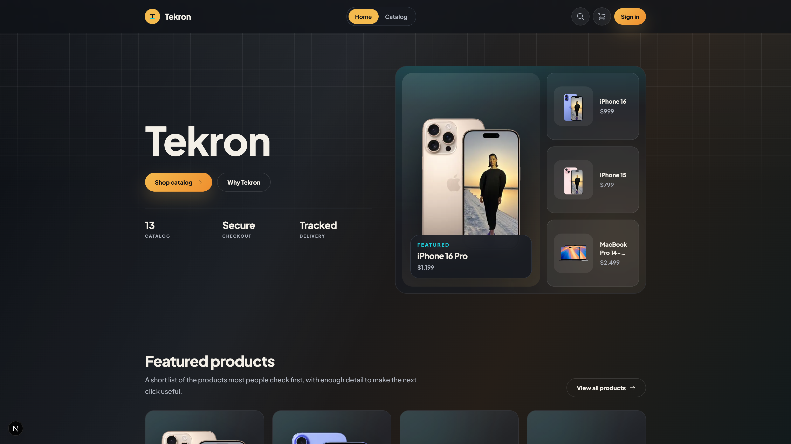
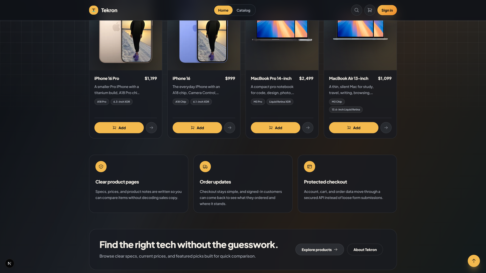
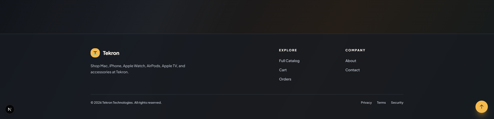

# Tekron E-Commerce Platform

Tekron is a state-of-the-art modern e-commerce application built with a premium dark-mode aesthetic, micro-animations, and glassmorphism. It features a robust Next.js frontend, an Express.js backend, and Event-Driven Architecture powered by Apache Kafka for asynchronous tasks like PDF Invoice generation and Real-Time Socket.IO updates.

## Tech Stack
- **Frontend**: Next.js 15 (App Router), TailwindCSS, Context API
- **Backend**: Node.js, Express, Mongoose
- **Database**: MongoDB (Containerized)
- **Caching**: Redis
- **Message Broker**: Apache Kafka & Zookeeper (Confluent 7.5.0) for high-performance decoupled event processing.
- **Real-Time**: Socket.IO for live order status updates
- **PDF Generation**: Puppeteer (Beautiful HTML/Tailwind rendering)

## Architecture & Technologies Explained

This project is built to mimic a highly scalable, enterprise-grade e-commerce platform. Here is why each core backend technology was chosen:

- **Express.js Backend**: Acts as the core REST API. It handles authentication, data validation, and serves as the primary gateway between the frontend application and the database.
- **Apache Kafka (Message Broker)**: Generating heavy PDF invoices synchronously during checkout blocks the server's main thread, causing slow page loads for the customer. With Kafka, the backend simply fires a `new_order` event and instantly returns a success response. A completely decoupled background worker listens to this event and handles the heavy lifting safely.
- **Redis (Caching)**: E-commerce platforms are extremely read-heavy. Redis is utilized to cache frequent MongoDB queries (like fetching the product catalog), drastically reducing database load and delivering lightning-fast product pages to the frontend.
- **Socket.IO (WebSockets)**: Because heavy tasks (like invoice generation) are moved to the background via Kafka, we need a way to tell the user when it's done. Socket.IO pushes a real-time notification to the client browser (and the Admin dashboard) the exact millisecond the PDF is ready, avoiding inefficient HTTP polling.
- **Puppeteer**: Runs headlessly inside the Kafka worker to render a beautiful HTML/TailwindCSS template into a pristine, vector-sharp PDF document.
## Quick Start
You can launch the entire stack using the included batch script.

1. Ensure Docker Desktop is running.
2. Double-click the `start.bat` file in the root folder.
3. This will automatically:
   - Spin up Kafka, Zookeeper, and Redis via Docker Compose
   - Start the Backend Server on `http://localhost:5000`
   - Start the Frontend Server on `http://localhost:3000`

### End-to-End Demo
The application includes a fully verified, pristine checkout flow. When an order is placed, Kafka instantly picks up the `new_order` event and asynchronously generates a beautifully branded PDF invoice in the background without blocking the UI.

### Homepage Tour

## Features
- Complete Cart & Checkout functionality
- Admin Dashboard with metrics and live status controls
- Beautiful automated PDF invoice generation with native vector branding
- Real-time user notifications via WebSockets
- Highly scalable decoupled architecture
