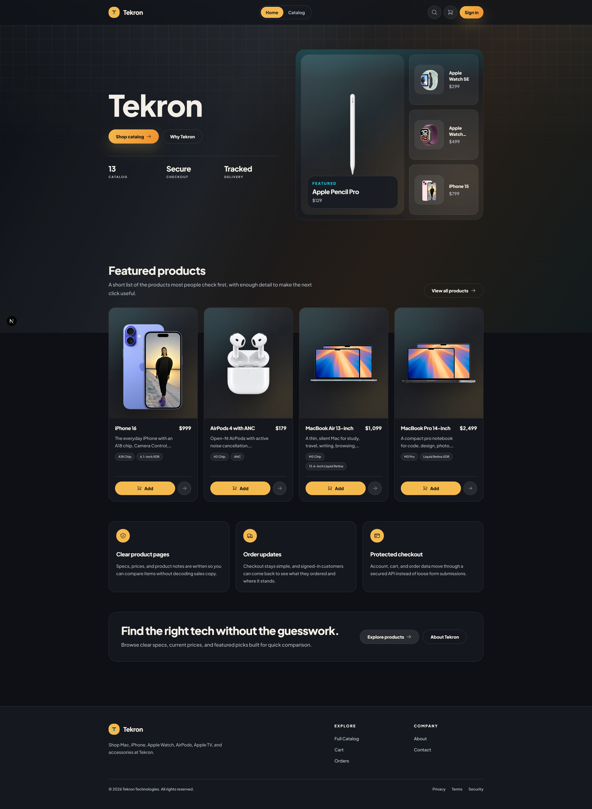

# Tekron E-Commerce Platform

Tekron is a state-of-the-art modern e-commerce application built with a premium dark-mode aesthetic, micro-animations, and glassmorphism. It features a robust Next.js frontend, an Express.js backend, and Event-Driven Architecture powered by Apache Kafka for asynchronous tasks like PDF Invoice generation and Real-Time Socket.IO updates.

## Tech Stack
- **Frontend**: Next.js 15 (App Router), TailwindCSS, Context API
- **Backend**: Node.js, Express, Mongoose
- **Database**: MongoDB (Containerized)
- **Caching**: Redis
- **Message Broker**: Apache Kafka & Zookeeper (Confluent 7.5.0) for high-performance decoupled event processing.
- **Real-Time**: Socket.IO for live order status updates
- **PDF Generation**: Puppeteer (Beautiful HTML/Tailwind rendering)

## Quick Start
You can launch the entire stack using the included batch script.

1. Ensure Docker Desktop is running.
2. Double-click the `start.bat` file in the root folder.
3. This will automatically:
   - Spin up Kafka, Zookeeper, and Redis via Docker Compose
   - Start the Backend Server on `http://localhost:5000`
   - Start the Frontend Server on `http://localhost:3000`

### End-to-End Demo
The application includes a fully verified, pristine checkout flow. When an order is placed, Kafka instantly picks up the `new_order` event and asynchronously generates a beautifully branded PDF invoice in the background without blocking the UI.

## Features
- Complete Cart & Checkout functionality
- Admin Dashboard with metrics and live status controls
- Beautiful automated PDF invoice generation with native vector branding
- Real-time user notifications via WebSockets
- Highly scalable decoupled architecture
