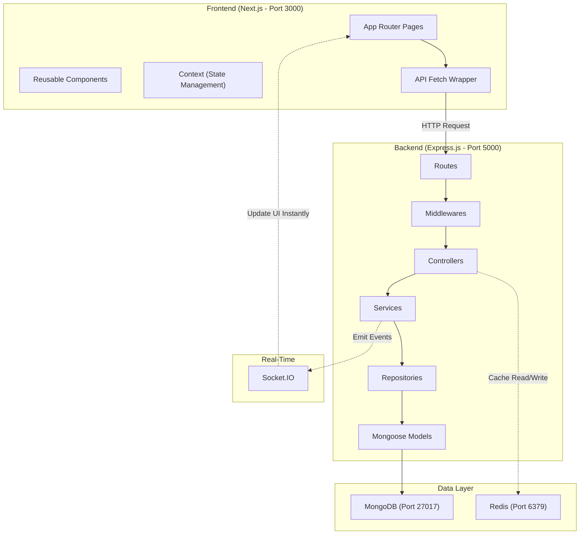

# Tekron E-Commerce — The Ultimate Codebase Walkthrough

> This document maps out **every single file** in the frontend (47 files) and backend (57 files). For every file and concept, it provides both the **Technical Explanation** (the exact engineering terms you need to say in your viva) AND the **Simple Analogy** (so you intuitively understand how it works).

---

# Part 1: Architecture Overview

### The Big Picture
* **Technical**: We use a decoupled, layered architecture. The Next.js frontend communicates with a RESTful Express.js backend via HTTP. The backend follows the Controller-Service-Repository pattern, utilizing MongoDB for persistent storage, Redis for stateless caching, and WebSockets (Socket.IO) for real-time bidirectional events.
* **Analogy (The Restaurant)**: The Frontend is the Dining Area where customers sit. The Backend is the Waiter taking orders to the Kitchen. MongoDB is the Kitchen's filing cabinet holding recipes. Redis is the Waiter's sticky note for fast answers. Socket.IO is a walkie-talkie connecting the Kitchen instantly to the Waiter.

---

# Part 2: Backend (Express.js)
*Location: `/backend` folder*

## 2.1 Root Files
* **`package.json`**:
  * **Technical**: Project manifest using CommonJS modules. Defines dependencies like `express`, `mongoose`, `redis`, `socket.io`, `bcryptjs`, and `joi`.
  * **Analogy**: The shopping list of tools we bought to build the kitchen.
* **`server.js`**:
  * **Technical**: The application entry point. Bootstraps the environment (`dotenv`), establishes connections to MongoDB and Redis, attaches Socket.IO to the raw Node HTTP server, and begins listening on Port 5000. Includes an `unhandledRejection` handler for graceful shutdowns.
  * **Analogy**: The Main Power Switch that turns on the lights, unlocks the kitchen, and turns on the walkie-talkies.

## 2.2 `src/app.js` — Express App Setup
* **Technical**: Configures the core Express application. Registers the middleware stack sequentially (Helmet -> CORS -> Rate Limiting -> Body Parsers -> Morgan Logging) and mounts all API routes under the `/api/v1/` prefix. Ends with a global error handler.
* **Analogy**: The Rulebook. It hires all the security guards and draws the map showing where every request should go.

## 2.3 `src/config/` — Configuration Files
* **`db.js`**:
  * **Technical**: Establishes the Mongoose ODM connection to `mongodb://127.0.0.1:27017/tekron`.
* **`env.js`**:
  * **Technical**: Validates that required environment variables exist (`requireEnv`), preventing the app from booting if critical secrets are missing in production.
* **`passport.js`**:
  * **Technical**: Configures the Passport Local Strategy. Verifies email/password against the DB using `bcrypt.compare`. Since the app is stateless, it intentionally omits `serializeUser`/`deserializeUser` session logic.
* **`redis.js`**:
  * **Technical**: Creates a Redis client singleton with graceful degradation (exponential backoff reconnects). If Redis fails, the app continues to work without caching.

## 2.4 `src/middlewares/` — The Security Guards
* **`helmet` (in app.js)**:
  * **Technical**: Sets HTTP security headers (CSP, X-Frame-Options) to mitigate XSS and clickjacking.
  * **Analogy**: The Bodyguard locking hidden doors to stop hackers.
* **`rateLimit.middleware.js`**:
  * **Technical**: Uses `express-rate-limit` to restrict IPs to 100 requests/15m globally, preventing DDoS and brute-force attacks.
  * **Analogy**: The Bouncer stopping a single person from spamming the waiter.
* **`validate.middleware.js` (uses Joi)**:
  * **Technical**: Validates `req.body` against a strict Joi schema. Uses `stripUnknown: true` to silently drop any malicious/unexpected fields from the JSON payload.
  * **Analogy**: The strict Spellchecker that deletes bad inputs before they reach the database.
* **`auth.middleware.js`**:
  * **Technical**: Extracts the `Bearer` token from the `Authorization` header, mathematically verifies the JWT signature, and attaches the decoded `req.user`. Handles Role-Based Access Control (RBAC).
  * **Analogy**: The VIP Checker looking for your secure wristband before letting you into the boss's room.
* **`cache.middleware.js`**:
  * **Technical**: Intercepts `res.json()`. On a cache hit, it serves the JSON string directly from Redis in memory. On a miss, it executes the query and caches the result with a TTL (Time-To-Live).
  * **Analogy**: The Sticky Note Reader that remembers answers so we don't bother the database.
* **`async.middleware.js`**:
  * **Technical**: A high-order function wrapping controllers in `Promise.resolve().catch(next)` to eliminate repetitive `try/catch` blocks.
* **`error.middleware.js`**:
  * **Technical**: The global error boundary. Catches Mongoose `CastError` or `TokenExpiredError` and standardizes them into clean JSON responses.

## 2.5 `src/models/` — Mongoose Schemas (The Filing Cabinets)
* **`user.model.js`**:
  * **Technical**: Enforces required fields, uniqueness on `email`, and uses a `pre('save')` hook to automatically hash the password with `bcryptjs` (10 salt rounds) before writing to the disk.
* **`product.model.js`**:
  * **Technical**: Stores product data. Uses `isActive` for "soft deletion" (hiding products without actually deleting the row).
* **`order.model.js`**:
  * **Technical**: Denormalizes the order items. It embeds a hardcopy snapshot of the product name, image, and price directly inside the order document at checkout.
  * **Analogy**: Taking a photograph of the price tag. If the admin changes the price tomorrow, the old receipt stays historically accurate.
* **`cart.model.js`**: Unique constraint per user to store cart state.
* **`review.model.js`**: Compound unique index `{ user, product }` ensuring one review per user per product.
* **`refreshToken.model.js`**: Stores a SHA-256 hash of the long-lived refresh token to prevent token reuse attacks.
* **`storeSettings.model.js`**: Singleton document for global store configs (tax rate, currency).

## 2.6 `src/controllers/` — Controller Layer (The Managers)
* **`auth.controller.js`**:
  * **Technical**: Handles login/registration. Issues short-lived JWT Access Tokens to memory, and sets the long-lived Refresh Token in an `httpOnly` cookie to prevent JavaScript access (XSS protection).
* **`product.controller.js`**: Handles CRUD. Calls `serializeProduct()` to hide sensitive fields (like exact stock counts) from non-admin users.
* **`order.controller.js`**: Delegates HTTP requests directly to the Service layer.
* **`admin.controller.js`**: Aggregates MongoDB queries using pipelines (`$match`, `$group`) to calculate total revenue and 30-day analytics.
* **Others**: `cart.controller.js`, `review.controller.js`, `contact.controller.js`, `notification.controller.js`, `upload.controller.js`.

## 2.7 `src/services/` — Business Logic Layer (The Workers)
* **`order.service.js` (Most Complex File)**:
  * **Technical**: Calculates tax. Executes an **atomic update** to decrement stock (`$inc: { stock: -quantity }`) paired with a guard (`stock: { $gte: quantity }`) to prevent race conditions (two people buying the last item). Finally, emits a Socket.IO event.
  * **Analogy**: The worker who carefully takes your money, updates the inventory list so nobody else can buy it, and buzzes the walkie-talkie to alert the kitchen.
* **`product.service.js`**: Handles regex-based search queries and pagination.
* **`review.service.js`**: Triggers a MongoDB aggregation to recalculate the `ratingAverage` every time a review is added.

## 2.8 `src/repositories/` — Data Access Layer (The Librarians)
* **`order.repository.js` & `product.repository.js`**:
  * **Technical**: Abstracts raw Mongoose queries (`findById`, `updateOne`) away from the business logic.
  * **Analogy**: The librarians. They are the *only* ones allowed to physically open the MongoDB filing cabinets and hand the folders to the workers.

## 2.9 `src/routes/` & 2.10 `src/validators/` (The Map & The Rules)
* **`routes/*.js`**: Defines the endpoints (`POST /auth/login`, `GET /products`). Attaches specific middlewares (like `protect`, `authLimiter`) to specific routes.
* **`validators/*.js`**: Defines the Joi object schemas (e.g., `Joi.string().email()`, `Joi.number().min(1).max(5)`).

## 2.11 `src/sockets/socket.js` — WebSockets (The Walkie-Talkies)
* **Technical**: Upgrades HTTP to WebSocket. Extracts the JWT from the handshake, verifies the user, and assigns them to an isolated Socket "room" (`user:{id}`). Admins join `admin_room`. This allows targeted server-to-client event pushing (`order-status-updated`).

---

# Part 3: Frontend (Next.js)
*Location: `/frontend` folder*

## 3.1 Root Configuration
* **`package.json`**: React 18, TailwindCSS, Socket.IO-Client.
* **`next.config.js`**:
  * **Technical**: Configures API `rewrites()` to proxy `/api/v1` to `localhost:5000` during development, bypassing browser CORS restrictions.
* **`tailwind.config.js`**:
  * **Technical**: Extends the default theme. Maps CSS variables (`--primary`) to Tailwind utility classes, and defines custom `@keyframes` for hardware-accelerated animations (`fadeLift`, `cartPop`).

## 3.2 Global Styles (`app/globals.css`)
* **Technical**: Defines root HSL color variables. Applies a base64-encoded SVG noise texture to the `body` background merged with a radial gradient. Defines `.surface-card` utility classes using `backdrop-filter: blur(...)`.
* **Analogy**: The paint and decor. We made it look premium by adding physical "TV static" texture and frosted glass to everything.

## 3.3 Context / State Management (The Memory)
* **`AuthContext.jsx`**:
  * **Technical**: React Context provider. Holds the `user` object in state. On mount, silently calls `/auth/refresh-token` to auto-login returning users.
* **`CartContext.jsx`**:
  * **Technical**: Manages cart state. If unauthenticated, it persists to `window.localStorage`. Upon login, it executes a smart merge, syncing the local cart with the backend database.

## 3.4 API Utilities (`lib/api.js`)
* **Technical**: A custom wrapper around the native `fetch` API. It automatically intercepts 401 Unauthorized errors, requests a new access token using the httpOnly refresh cookie, and seamlessly retries the original failed request.

## 3.5 App Router Pages (The Rooms)
* **`app/(site)/page.js`**: Home page with `HeroSlideshow`.
* **`app/(site)/products/page.jsx`**: Product catalog with debounce searching.
* **`app/(site)/checkout/page.jsx`**: Checkout flow supporting both guest and authenticated users. Triggers the `Confetti` component on success.
* **`app/(site)/orders/page.jsx`**: Mounts the `socket.on('order-status-updated')` listener to re-fetch orders in real time.
* **`app/admin/page.jsx`**: Admin dashboard protected by layout route guards. Listens for `socket.on('new-order')` to update revenue live.
* **Others**: `cart`, `about`, `login`, `register`, `admin/analytics`, `admin/products`.

## 3.6 Components (The LEGO Pieces)
* **`ProductCard.js`**:
  * **Technical**: Calculates pointer coordinates relative to the bounding box to apply CSS `transform: perspective(900px) rotateX(...) rotateY(...)` for a 3D tilt effect.
* **`ScrollReveal.jsx`**:
  * **Technical**: Utilizes the native `IntersectionObserver` API. When an element intersects the viewport threshold, it toggles Tailwind opacity and translation classes.
* **`BackgroundShapes.jsx`**:
  * **Technical**: Absolute-positioned `div`s with `blur-[120px]` and infinite CSS `@keyframes float` to create the moving aurora effect without utilizing heavy JS requestAnimationFrame loops.
* **`Navbar.jsx`**: Uses scroll event listeners to dynamically increase the `backdrop-blur` intensity as the user scrolls down.
* **Others**: `CartDrawer`, `Confetti`, `SearchOverlay`, `HeroSlideshow`, `ImageUploadField`.

---

# Part 4: Technical Viva Q&A

**Q1: Why did you choose Next.js instead of regular React?**
* **Technical**: "Next.js provides the App Router with Server-Side Rendering (SSR). This reduces the initial JavaScript payload to the browser, offering a faster First Contentful Paint (FCP) and significantly better SEO compared to a traditional Client-Side Rendered (CSR) SPA."
* **Analogy**: "It's like a restaurant that pre-cooks the food. When a user visits, the page loads instantly because the server already prepared the HTML. Regular React makes the user's browser do all the cooking, which is slower."

**Q2: How does your authentication system work? Are you using sessions?**
* **Technical**: "No, it is entirely stateless. We implemented JWT (JSON Web Tokens). Upon login, the server issues a short-lived access token (kept in memory) and a long-lived refresh token (stored securely in an `httpOnly` cookie to prevent XSS). We also utilized Refresh Token Rotation to prevent token reuse."
* **Analogy**: "It's like giving users a cryptographic VIP wristband. The server doesn't need to remember who is logged in via a database session; it just mathematically verifies the wristband on every request."

**Q3: How are you handling real-time updates?**
* **Technical**: "I integrated Socket.IO for WebSockets. When a mutation occurs (like an order status changing in the DB), the Express service emits an event targeting a specific `user:{id}` room. The Next.js client listens for this event and triggers a React state update instantly."
* **Analogy**: "It's a two-way walkie-talkie. Instead of the browser constantly asking the server 'is my order ready?', the server just buzzes the browser the exact second the status changes."

**Q4: How did you optimize the backend performance?**
* **Technical**: "I implemented a stateless Redis caching layer via middleware. For read-heavy endpoints like the product catalog, the API attempts to retrieve the JSON response from Redis memory. On a cache hit, it bypasses the MongoDB query completely, reducing latency from ~100ms down to ~5ms."
* **Analogy**: "Redis is the server's sticky note. Instead of walking to the kitchen filing cabinet every time, the waiter writes the answer on a sticky note and serves the next 100 customers instantly."

**Q5: What security measures did you implement?**
* **Technical**: "I employed defense-in-depth: `Helmet.js` sets secure HTTP headers. `express-rate-limit` prevents brute-forcing. `Joi` strictly sanitizes incoming JSON payloads. Finally, `bcryptjs` utilizes 10 salt rounds to hash passwords, ensuring plain-text passwords are never stored."
* **Analogy**: "Helmet is the bodyguard locking doors. The rate-limiter is the bouncer stopping spammers. Joi is the spellchecker deleting bad data."

**Q6: How did you design the database for Orders? What happens if a product's price changes?**
* **Technical**: "In MongoDB, I intentionally denormalized the order item subdocuments. Instead of merely storing an `ObjectId` reference to the Product, the system takes a snapshot of the product's name and price at checkout time. This ensures the historical integrity of the receipt."
* **Analogy**: "We take a photograph of the price tag when you check out. If the admin deletes the product or doubles the price tomorrow, your old receipt doesn't change."

**Q7: How did you implement smooth animations?**
* **Technical**: "I avoided JS-based animation loops (like GSAP) and relied on hardware-accelerated CSS properties (`transform: translate` and `scale`) via Tailwind keyframes. CSS animations are offloaded to the GPU, preventing main-thread blocking and ensuring 60fps performance."
* **Analogy**: "Heavy Javascript animations slow down computers. By using CSS, we tell the computer's Graphics Card to handle the smooth sliding and fading, which works perfectly even on slow phones."
