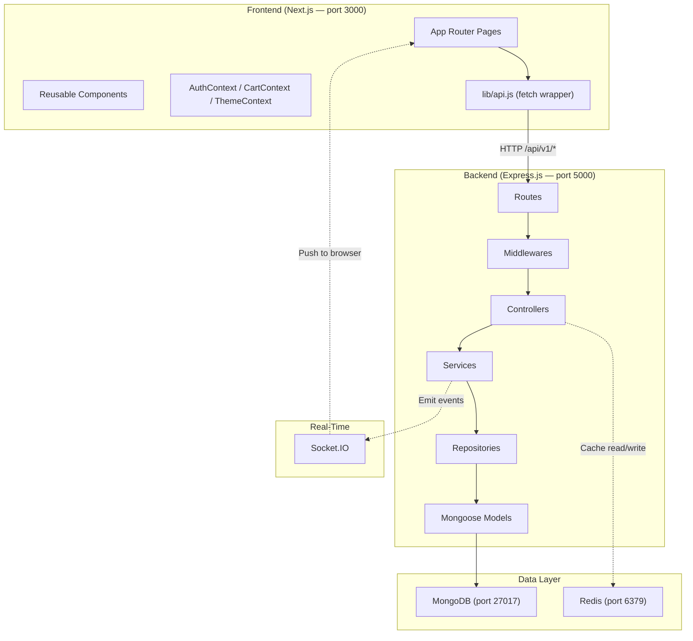

# Tekron E-Commerce — Complete Codebase Walkthrough

> Every single file in the frontend (47 files) and backend (57 files) explained in detail — architecture, libraries, animations, security, caching, and design patterns.

---

# Part 1: Architecture Overview



### Data Flow Summary
```
[Browser] → fetch(/api/v1/...) → [Express Routes] → [Middleware Chain] → [Controller] → [Service] → [Repository] → [MongoDB]
                                                                                              ↕
                                                                                          [Redis Cache]
                                                                                              ↕
                                                                                        [Socket.IO Events]
```

---

# Part 2: Backend (Express.js)

## 2.1 Root Files

### [package.json](file:///c:/Users/muham/OneDrive/Desktop/tekron/backend/package.json)
Project manifest. Module system is **CommonJS**. Entry point: `server.js`.

| Package | Purpose |
|---------|---------|
| `express` ^5.2.1 | Web framework (**Express 5**) |
| `mongoose` ^9.6.2 | MongoDB ODM |
| `redis` ^5.12.1 | Redis client for stateless caching |
| `socket.io` ^4.8.3 | WebSocket real-time events |
| `jsonwebtoken` ^9.0.3 | JWT access token generation |
| `passport` / `passport-local` | Authentication strategy |
| `bcryptjs` ^3.0.3 | Password hashing (10 salt rounds) |
| `joi` ^18.2.1 | Request body/params validation |
| `helmet` ^8.2.0 | Security HTTP headers |
| `cors` ^2.8.6 | Cross-Origin Resource Sharing |
| `express-rate-limit` ^8.5.2 | Request rate limiting |
| `express-mongo-sanitize` ^2.2.0 | NoSQL injection prevention (⚠️ installed but unused) |
| `morgan` ^1.10.1 | HTTP request logging |
| `compression` ^1.8.1 | Gzip response compression |
| `cookie-parser` ^1.4.7 | Cookie parsing for refresh tokens |
| `multer` ^2.1.1 | Multipart file upload handling |
| `cloudinary` ^2.10.0 | Cloud image hosting (⚠️ installed but unused) |
| `dotenv` ^17.4.2 | Loads `.env` into `process.env` |
| `uuid` ^14.0.0 | UUID generation (⚠️ installed but unused) |

### [server.js](file:///c:/Users/muham/OneDrive/Desktop/tekron/backend/server.js) — Entry Point
Bootstraps the entire application:
1. Loads `dotenv`
2. Requires the Express `app` from `src/app.js`
3. Connects to MongoDB
4. Connects to Redis
5. Creates a raw `http.createServer(app)` — this is needed so Socket.IO can share the same HTTP server
6. Initializes Socket.IO on that server
7. Listens on `PORT` (default 5000)

Also includes:
- Graceful `EADDRINUSE` error with Windows-specific fix instructions
- `unhandledRejection` handler: closes server then exits with code 1

---

## 2.2 `src/app.js` — Express App Setup

[app.js](file:///c:/Users/muham/OneDrive/Desktop/tekron/backend/src/app.js) is the heart of the backend. It configures the Express app with all middleware and routes.

### Middleware Stack (applied in this exact order):

| # | Middleware | What It Does |
|---|-----------|-------------|
| 1 | `helmet()` | Sets security headers: `X-Content-Type-Options`, `X-Frame-Options`, CSP, HSTS, etc. |
| 2 | `cors()` | Allows requests only from `FRONTEND_URL` with `credentials: true` for cookies |
| 3 | `globalLimiter` | Rate limits ALL routes to 100 req/15min per IP |
| 4 | `express.json()` | Parses JSON request bodies (1MB max) |
| 5 | `express.urlencoded()` | Parses URL-encoded form data (1MB max) |
| 6 | `cookieParser()` | Parses cookies (needed for refresh tokens stored in httpOnly cookies) |
| 7 | `compression()` | Gzip/deflate compresses all responses |
| 8 | `express.static` | Serves uploaded images from `/uploads` |
| 9 | `morgan('dev')` | HTTP request logging (development only) |
| 10 | `passport.initialize()` | Initializes Passport (stateless — no sessions) |

### Registered API Routes (all under `/api/v1/`):
| Route | Purpose |
|-------|---------|
| `/auth` | Register, login, logout, refresh token, profile |
| `/products` | Product catalog CRUD |
| `/orders` | Order creation, listing, cancellation |
| `/cart` | Cart management (add, update, remove, clear) |
| `/admin` | Admin dashboard, orders, customers, analytics, settings |
| `/contact` | Contact form submission |
| `/reviews` | Product reviews |
| `/notifications` | User notifications |
| `/upload` | Image upload |

### Additional endpoints:
- `GET /health` — Health check
- `GET /` — Simple "API running" message
- **404 catch-all** — Any unmatched route throws `ApiError(404)`
- **Global error handler** — Final middleware

---

## 2.3 `src/config/` — Configuration

### [db.js](file:///c:/Users/muham/OneDrive/Desktop/tekron/backend/src/config/db.js)
Connects to MongoDB using Mongoose. Falls back to `mongodb://127.0.0.1:27017/tekron`. Logs host on success, exits process on failure.

### [env.js](file:///c:/Users/muham/OneDrive/Desktop/tekron/backend/src/config/env.js)
Environment variable validation:
- `requireEnv(name, fallback)` — Returns env var; **throws in production** if using a default fallback
- `getJwtAccessSecret()` — Wraps `requireEnv` for the JWT secret
- `assertProductionEnv()` — Called at startup, validates critical vars exist in production

### [passport.js](file:///c:/Users/muham/OneDrive/Desktop/tekron/backend/src/config/passport.js)
Configures the **Passport Local Strategy** for email/password login:
1. Finds user by email (with `+password` to override `select: false`)
2. Checks `isActive` flag
3. Compares password hash via bcrypt
4. **Stateless** — no `serializeUser`/`deserializeUser` (no sessions, JWT only)

### [redis.js](file:///c:/Users/muham/OneDrive/Desktop/tekron/backend/src/config/redis.js)
Redis client singleton with graceful degradation:
- Can be disabled via `REDIS_ENABLED=false`
- Singleton pattern with deduplication of concurrent connection attempts
- Exponential reconnect strategy: `Math.min(retries * 100, 3000)` ms
- Suppresses repeated error logs (only logs the first "Redis unavailable" message)
- The entire app works fine without Redis — caching just gets skipped

---

## 2.4 `src/middlewares/` — All 8 Middlewares

### [async.middleware.js](file:///c:/Users/muham/OneDrive/Desktop/tekron/backend/src/middlewares/async.middleware.js) — Async Handler
```javascript
const asyncHandler = (fn) => (req, res, next) => {
  Promise.resolve(fn(req, res, next)).catch(next);
};
```
Wraps every async controller function. If the promise rejects, the error is automatically forwarded to the global error handler via `next()`. This eliminates the need for `try/catch` in every single controller.

### [auth.middleware.js](file:///c:/Users/muham/OneDrive/Desktop/tekron/backend/src/middlewares/auth.middleware.js) — JWT Auth & RBAC
Three exports:
- **`protect`** — Extracts `Bearer` token from `Authorization` header → verifies JWT → loads user from DB → checks `isActive` → attaches `req.user`
- **`optionalAuth`** — Same as `protect` but silently continues if no token (used for guest checkout and public product views where admin users see extra data)
- **`authorizeRoles(...roles)`** — Middleware factory that checks `req.user.role` against a whitelist of allowed roles (e.g., `authorizeRoles('admin')`)

### [cache.middleware.js](file:///c:/Users/muham/OneDrive/Desktop/tekron/backend/src/middlewares/cache.middleware.js) — Stateless Redis Cache
Two exports:
- **`cache(keyBuilder, ttlSeconds=3600)`** — Middleware factory:
  - `keyBuilder` can be a string or a function `(req) => string`
  - On **HIT**: returns cached JSON immediately from Redis
  - On **MISS**: intercepts `res.json()` to cache successful (2xx) responses before sending
  - Gracefully skips if Redis is unavailable
- **`clearCache(keyPattern)`** — Deletes all keys matching a glob pattern

### [conditional.middleware.js](file:///c:/Users/muham/OneDrive/Desktop/tekron/backend/src/middlewares/conditional.middleware.js) — Conditional Middleware
`conditionalMiddleware(condition, middleware)` — Only applies the given middleware if the condition evaluates to `true`. Used for applying auth/cache selectively on certain routes.

### [error.middleware.js](file:///c:/Users/muham/OneDrive/Desktop/tekron/backend/src/middlewares/error.middleware.js) — Global Error Handler
Catches all errors and normalizes them:
| Error Type | Status | Message |
|-----------|--------|---------|
| `CastError` (bad ObjectId) | 404 | Resource not found |
| Duplicate key (code 11000) | 400 | Duplicate field value |
| Mongoose `ValidationError` | 400 | Joined validation messages |
| `JsonWebTokenError` | 401 | Invalid token |
| `TokenExpiredError` | 401 | Token expired |
| Default | 500 | Server error |

Stack traces are **only** included in development mode — never leaked in production.

### [rateLimit.middleware.js](file:///c:/Users/muham/OneDrive/Desktop/tekron/backend/src/middlewares/rateLimit.middleware.js) — Rate Limiting
Two limiters using `express-rate-limit`:
- **`globalLimiter`** — 100 requests / 15 minutes per IP (applied to ALL routes)
- **`authLimiter`** — 10 requests / 15 minutes per IP (applied only to login/register/refresh)

### [upload.middleware.js](file:///c:/Users/muham/OneDrive/Desktop/tekron/backend/src/middlewares/upload.middleware.js) — Multer File Upload
- **Storage**: Disk storage in `backend/uploads/`
- **Filename**: `{timestamp}-{randomBytes}{extension}`
- **Allowed types**: JPEG, PNG, WebP, GIF
- **Max size**: 5MB

### [validate.middleware.js](file:///c:/Users/muham/OneDrive/Desktop/tekron/backend/src/middlewares/validate.middleware.js) — Joi Validation
`validate(schema, source='body')` — Validates `req[source]` against a Joi schema:
- `abortEarly: false` — returns ALL validation errors, not just the first
- `stripUnknown: true` — silently removes unexpected fields (security)
- Replaces `req[source]` with the cleaned, validated value

---

## 2.5 `src/models/` — Mongoose Schemas (8 Models)

### [user.model.js](file:///c:/Users/muham/OneDrive/Desktop/tekron/backend/src/models/user.model.js)
| Field | Type | Notes |
|-------|------|-------|
| name | String | Required, trimmed |
| email | String | Required, unique, lowercase |
| password | String | Required, `select: false` (never returned in queries) |
| role | String | `enum: ['customer', 'admin', 'seller']`, default: `customer` |
| avatar | String | Profile picture URL |
| phone | String | |
| address | Subdoc | street, city, state, zipCode, country |
| isActive | Boolean | Default: true |

**Hooks**: `pre('save')` — Hashes password with bcrypt (10 rounds)
**Methods**: `comparePassword()`, `toJSON()` strips password

### [product.model.js](file:///c:/Users/muham/OneDrive/Desktop/tekron/backend/src/models/product.model.js)
| Field | Type | Notes |
|-------|------|-------|
| name | String | Required |
| slug | String | Unique, lowercase (URL-friendly) |
| description | String | Required |
| price / compareAtPrice | Number | Min: 0 |
| category | String | Indexed for fast queries |
| brand | String | |
| images | [String] | Array of image URLs |
| stock | Number | Default: 0 |
| ratingAverage / ratingCount | Number | Computed from reviews |
| isFeatured / isActive | Boolean | Featured flag + soft delete |
| createdBy | ObjectId → User | Admin who created it |

### [order.model.js](file:///c:/Users/muham/OneDrive/Desktop/tekron/backend/src/models/order.model.js)
| Field | Type | Notes |
|-------|------|-------|
| user | ObjectId → User | Optional (guest checkout supported) |
| guestCustomer | Subdoc | name + email for unauthenticated orders |
| items | [orderItemSchema] | product ref + denormalized name/image/price/quantity |
| shippingAddress | Subdoc | street, city, state, zipCode, country |
| paymentMethod | String | Default: `COD` |
| paymentStatus | String | `pending / completed / failed / refunded` |
| orderStatus | String | `pending / confirmed / processing / shipped / delivered / cancelled` |
| subtotal / shippingFee / tax / total | Number | |

### [cart.model.js](file:///c:/Users/muham/OneDrive/Desktop/tekron/backend/src/models/cart.model.js)
One cart per user (unique constraint on `user`). Items contain product ref + quantity.

### [review.model.js](file:///c:/Users/muham/OneDrive/Desktop/tekron/backend/src/models/review.model.js)
Rating (1–5) + comment. Compound unique index `{ user, product }` — one review per user per product.

### [notification.model.js](file:///c:/Users/muham/OneDrive/Desktop/tekron/backend/src/models/notification.model.js)
Supports user-specific (`recipient`) and role-based (`roleTarget`) notifications.

### [refreshToken.model.js](file:///c:/Users/muham/OneDrive/Desktop/tekron/backend/src/models/refreshToken.model.js)
Stores SHA-256 hash of the refresh token (never plain text), `jti` (unique ID), `expiresAt`, `revokedAt`, `createdByIp`, `replacedByToken` for rotation chain tracking.

### [storeSettings.model.js](file:///c:/Users/muham/OneDrive/Desktop/tekron/backend/src/models/storeSettings.model.js)
Singleton document for store configuration (name, currency, tax rate, shipping rates, etc.). Upserted on every read/write.

---

## 2.6 `src/controllers/` — Controller Layer (9 Controllers)

### [auth.controller.js](file:///c:/Users/muham/OneDrive/Desktop/tekron/backend/src/controllers/auth.controller.js)
| Endpoint | What It Does |
|----------|-------------|
| `register` | Creates user → generates access + refresh tokens → sets `jwt` httpOnly cookie → returns user + accessToken |
| `login` | Uses Passport `authenticate('local', { session: false })` → same token flow |
| `refreshToken` | Reads `jwt` cookie → SHA-256 hashes → looks up in DB → validates → generates NEW tokens → **revokes old token** → sets new cookie |
| `logout` | Revokes refresh token → sets cookie to 'none' with 10s expiry |
| `getMe` | Returns current user profile |
| `updateProfile` | Updates name, phone, address, avatar |

> [!IMPORTANT]
> **Refresh Token Rotation**: Every time a token is refreshed, the old one is revoked and a `replacedByToken` chain is recorded. This prevents token reuse attacks.

### [admin.controller.js](file:///c:/Users/muham/OneDrive/Desktop/tekron/backend/src/controllers/admin.controller.js)
Dashboard stats (revenue, counts), order management, customer listing with aggregated spend, analytics (30-day data), profile management, store settings (singleton upsert pattern).

### [product.controller.js](file:///c:/Users/muham/OneDrive/Desktop/tekron/backend/src/controllers/product.controller.js)
CRUD for products. Uses `serializeProduct()` to hide stock/createdBy from non-admin users. Cache invalidation on every write operation.

### [cart.controller.js](file:///c:/Users/muham/OneDrive/Desktop/tekron/backend/src/controllers/cart.controller.js)
Full cart management with stock validation on add/update.

### [order.controller.js](file:///c:/Users/muham/OneDrive/Desktop/tekron/backend/src/controllers/order.controller.js)
Thin controller that delegates entirely to `orderService`.

### [review.controller.js](file:///c:/Users/muham/OneDrive/Desktop/tekron/backend/src/controllers/review.controller.js)
Thin controller delegating to `reviewService`.

### [contact.controller.js](file:///c:/Users/muham/OneDrive/Desktop/tekron/backend/src/controllers/contact.controller.js)
Creates admin notification with contact form data, returns 202.

### [notification.controller.js](file:///c:/Users/muham/OneDrive/Desktop/tekron/backend/src/controllers/notification.controller.js)
Lists notifications using `$or` query (personal + role-based + broadcast), mark read.

### [upload.controller.js](file:///c:/Users/muham/OneDrive/Desktop/tekron/backend/src/controllers/upload.controller.js)
Returns local path `/uploads/{filename}` after Multer saves the file.

---

## 2.7 `src/services/` — Business Logic Layer

### [order.service.js](file:///c:/Users/muham/OneDrive/Desktop/tekron/backend/src/services/order.service.js) — Most Complex File (256 lines)
- **createOrder**: Supports authenticated + guest checkout → validates items → **atomic stock decrement** (`$inc: -quantity` with `$gte` guard) → rollback on failure → calculates subtotal/shipping/tax → clears user cart → invalidates cache → creates admin notification → emits Socket.IO events (`new-order`, `low-stock-alert`)
- **updateOrderStatus**: Validates status enum → on cancellation, **restores stock atomically** → emits `order-status-updated` to user's specific socket room
- **cancelOrder**: Only allows cancelling `pending` or `confirmed` orders
- **Shipping logic**: Free over $1000, otherwise $50 flat; Tax: 10%

### [product.service.js](file:///c:/Users/muham/OneDrive/Desktop/tekron/backend/src/services/product.service.js)
- Custom slug generator, regex-safe search, query builder (category, featured, search, price range, pagination, sorting)
- Delete is **soft-delete** (`isActive: false`)

### [review.service.js](file:///c:/Users/muham/OneDrive/Desktop/tekron/backend/src/services/review.service.js)
- Creates reviews (validates user has ordered the product)
- Recalculates product `ratingAverage` and `ratingCount` via MongoDB aggregation pipeline after every review change

---

## 2.8 `src/repositories/` — Data Access Layer

### [order.repository.js](file:///c:/Users/muham/OneDrive/Desktop/tekron/backend/src/repositories/order.repository.js)
Pure data access: `findOrders`, `findOrderById`, `createOrder`, `updateOrder`. All reads use consistent `.populate()`.

### [product.repository.js](file:///c:/Users/muham/OneDrive/Desktop/tekron/backend/src/repositories/product.repository.js)
Pure data access: `findProducts`, `countProducts`, `findProductByIdOrSlug`, `createProduct`, `updateProduct`, `softDeleteProduct`. Smart ID-vs-slug detection via regex.

---

## 2.9 `src/routes/` — Route Definitions (9 Files)

### [auth.routes.js](file:///c:/Users/muham/OneDrive/Desktop/tekron/backend/src/routes/auth.routes.js)
```
POST /register  → authLimiter → validate(registerSchema) → register
POST /login     → authLimiter → validate(loginSchema) → login
POST /refresh   → authLimiter → refreshToken
POST /logout    → protect → logout
GET  /me        → protect → getMe
PATCH /profile  → protect → validate(updateProfileSchema) → updateProfile
```

### [product.routes.js](file:///c:/Users/muham/OneDrive/Desktop/tekron/backend/src/routes/product.routes.js)
```
GET    /      → optionalAuth → cache(dynamic key) → getProducts
POST   /      → protect → admin → validate → createProduct
GET    /:id   → optionalAuth → cache(dynamic key) → getProduct
PUT    /:id   → protect → admin → validate → updateProduct
DELETE /:id   → protect → admin → deleteProduct
```

### [order.routes.js](file:///c:/Users/muham/OneDrive/Desktop/tekron/backend/src/routes/order.routes.js)
```
POST   /            → optionalAuth → validate → createOrder (supports guest!)
GET    /            → protect → getMyOrders
GET    /:id         → protect → getOrder
PATCH  /:id/cancel  → protect → cancelMyOrder
```

### Other routes follow similar patterns with appropriate auth guards.

---

## 2.10 `src/validators/` — Joi Schemas (6 Files)

Each validator defines strict schemas for input validation:
- [auth.validator.js](file:///c:/Users/muham/OneDrive/Desktop/tekron/backend/src/validators/auth.validator.js) — register (name 2-50, email, password min 6), login, updateProfile
- [cart.validator.js](file:///c:/Users/muham/OneDrive/Desktop/tekron/backend/src/validators/cart.validator.js) — productId (24-char hex), quantity (1-99)
- [contact.validator.js](file:///c:/Users/muham/OneDrive/Desktop/tekron/backend/src/validators/contact.validator.js) — name, email, message (10-2000 chars)
- [order.validator.js](file:///c:/Users/muham/OneDrive/Desktop/tekron/backend/src/validators/order.validator.js) — shipping address, payment method, items array
- [product.validator.js](file:///c:/Users/muham/OneDrive/Desktop/tekron/backend/src/validators/product.validator.js) — name, slug, price, images (max 10), tags (max 12)
- [review.validator.js](file:///c:/Users/muham/OneDrive/Desktop/tekron/backend/src/validators/review.validator.js) — rating (1-5 integer), comment (max 1000)

---

## 2.11 `src/sockets/socket.js` — WebSocket Layer

[socket.js](file:///c:/Users/muham/OneDrive/Desktop/tekron/backend/src/sockets/socket.js):
- **Auth middleware**: Extracts JWT from `socket.handshake.auth.token` and verifies it
- **Rooms**: Every user joins `user:{userId}`; admins also join `admin_room`
- **Events emitted by server** (from order.service.js):
  - `new-order` → to `admin_room`
  - `low-stock-alert` → to `admin_room`
  - `order-status-updated` → to `user:{userId}`

---

## 2.12 `src/utils/` — Utilities

- [ApiError.js](file:///c:/Users/muham/OneDrive/Desktop/tekron/backend/src/utils/ApiError.js) — Custom error class with `statusCode`, `isOperational` flag
- [generateTokens.js](file:///c:/Users/muham/OneDrive/Desktop/tekron/backend/src/utils/generateTokens.js) — Access token (JWT, 15min), Refresh token (40 random bytes hex, SHA-256 hashed before DB storage, UUID jti), cookie options (httpOnly, secure, sameSite)
- [uploads.js](file:///c:/Users/muham/OneDrive/Desktop/tekron/backend/src/utils/uploads.js) — Ensures `uploads/` directory exists

---

## 2.13 `scripts/` — Seed & Migration

- [seed.js](file:///c:/Users/muham/OneDrive/Desktop/tekron/backend/scripts/seed.js) — Master script, runs seedAdmin then seedProducts
- [seedAdmin.js](file:///c:/Users/muham/OneDrive/Desktop/tekron/backend/scripts/seedAdmin.js) — Creates/updates admin user (`admin@tekron.com` / `Admin@12345`)
- [seedProducts.js](file:///c:/Users/muham/OneDrive/Desktop/tekron/backend/scripts/seedProducts.js) — Seeds 13 Apple products (iPhones, MacBooks, Watches, AirPods, etc.)
- [migrateCategories.js](file:///c:/Users/muham/OneDrive/Desktop/tekron/backend/scripts/migrateCategories.js) — One-time rename of 'Smartphones' → 'Phones'

---

# Part 3: Frontend (Next.js)

## 3.1 Root Configuration

### [package.json](file:///c:/Users/muham/OneDrive/Desktop/tekron/frontend/package.json)
| Dependency | Purpose |
|-----------|---------|
| `next` ^16.2.7 | React framework with App Router |
| `react` / `react-dom` ^18 | UI library |
| `tailwindcss` ^3.4.1 | Utility-first CSS framework |
| `@heroicons/react` ^2.1.1 | SVG icon components |
| `js-cookie` ^3.0.7 | Client-side cookie management |
| `react-hot-toast` ^2.4.1 | Toast notifications |
| `socket.io-client` ^4.8.3 | WebSocket client |
| `postcss` / `autoprefixer` | CSS processing |

### [next.config.js](file:///c:/Users/muham/OneDrive/Desktop/tekron/frontend/next.config.js)
- **API Proxy**: `rewrites()` proxies `/api/v1/:path*` → `http://localhost:5000/api/v1/:path*` (avoids CORS in development)
- **Images**: Allows any remote hostname, `unoptimized: true`

### [tailwind.config.js](file:///c:/Users/muham/OneDrive/Desktop/tekron/frontend/tailwind.config.js)
Extends the default theme with:
- **Custom colors** mapped to CSS variables: `background`, `foreground`, `card`, `border`, `primary`, `secondary`, `accent`, `muted`
- **Custom keyframe animations**: `fadeLift`, `scaleIn`, `cartPop`, `shimmer`, `float` (4 speeds), `divider`, `page-in`, `fade-up`
- **Body noise background**: A data-URI noise texture combined with a radial gradient

---

## 3.2 Global Styles — The Design System

### [globals.css](file:///c:/Users/muham/OneDrive/Desktop/tekron/frontend/app/globals.css) (~300 lines)

#### Color System (HSL Custom Properties)
```css
:root {
  --background: 222 47% 8%;       /* Deep navy */
  --foreground: 210 40% 98%;      /* Near-white */
  --card: 217 33% 12%;            /* Dark card */
  --border: 217 33% 18%;          /* Subtle border */
  --primary: 42 88% 69%;          /* Warm gold */
  --secondary: 173 58% 39%;       /* Teal */
  --accent: 199 89% 48%;          /* Sky blue */
  --muted: 217 33% 18%;
  --muted-foreground: 215 20% 55%;
}
```

#### @keyframes Animations

| Animation | Duration | Effect | Used In |
|-----------|----------|--------|---------|
| `fadeLift` | 600ms | translateY(18px) + opacity → visible | `surface-card` (staggered) |
| `scaleIn` | 400ms | scale(0.92) + opacity → visible | BackToTop, EmptyState, SearchOverlay |
| `cartPop` | 450ms | scale(0.94) + translateX(12px) → normal | CartDrawer open |
| `shimmer` | 1.8s ∞ | Horizontal gradient sweep | Skeleton loading |
| `float` | 6s ∞ | translateY bounce | — |
| `float-slow` | 18s ∞ | Slow float | BackgroundShapes blobs |
| `float-slower` | 24s ∞ | Slower float | BackgroundShapes blobs |
| `float-slowest` | 30s ∞ | Slowest float | BackgroundShapes blobs |
| `divider` | 2s ∞ | scaleX 0→1 pulse | SectionDivider line |
| `page-in` | 500ms | translateY(8px) + opacity | PageShell, admin layout |
| `fade-up` | 600ms | translateY(12px) + opacity | SearchOverlay |

#### Glassmorphism Classes

| Class | Backdrop Blur | Background | Border | Effect |
|-------|-------------|------------|--------|--------|
| `.surface-panel` | `backdrop-blur-2xl` | `bg-card/[0.72]` | `border-white/10` | Main panels, large cards |
| `.surface-card` | `backdrop-blur-xl` | `bg-card/[0.72]` | `border-border/70` | Product cards, feature cards |
| `.surface-muted` | — | `bg-white/[0.055]` | `border-white/10` | Subtle backgrounds |
| `.glass-card` | `backdrop-blur-md` | `bg-white/[0.08]` | — | Lightweight glass |
| `.aurora-sheen` | — | Gradient sweep | — | Animated color overlay |

#### Button & Input Styles
- `.btn-primary` — Rounded-full, gold background, `hover:-translate-y-0.5`, shadow glow
- `.btn-outline` — Rounded-full, transparent with border, hover brightens
- `.input-field` — Rounded corners, `bg-white/[0.07]`, focus ring in primary color
- `.icon-button` — 44×44px rounded square with border

#### Label System
- `.label` — Tiny uppercase pill badges
- Variants: `.label-primary` (gold), `.label-teal`, `.label-emerald`, `.label-amber`, `.label-rose`, `.label-accent` (blue)

---

## 3.3 App Layout & Providers

### [layout.jsx](file:///c:/Users/muham/OneDrive/Desktop/tekron/frontend/app/layout.jsx) — Root Layout
Sets `lang="en"`, loads **Inter** font from Google Fonts, wraps everything in `<Providers>`, applies noise background.

### [providers.jsx](file:///c:/Users/muham/OneDrive/Desktop/tekron/frontend/app/providers.jsx) — Provider Stack
```
ThemeProvider → AuthProvider → CartProvider → Toaster
```

---

## 3.4 Context (State Management)

### [AuthContext.jsx](file:///c:/Users/muham/OneDrive/Desktop/tekron/frontend/context/AuthContext.jsx)
- **Provides**: `user`, `loading`, `isAdmin`, `login()`, `register()`, `logout()`, `loadUser()`
- On mount: attempts to refresh token silently, then fetches `/auth/me`
- Login redirects admins to `/admin`, regular users to `/` (or `redirectTo` param)
- Logout clears cookie + state, redirects to `/auth/login`

### [CartContext.jsx](file:///c:/Users/muham/OneDrive/Desktop/tekron/frontend/context/CartContext.jsx)
- **Provides**: `cart`, `total`, `isCartDrawerOpen`, `addToCart()`, `removeFromCart()`, `updateQuantity()`, `clearCart()`, `openCartDrawer()`, `closeCartDrawer()`
- **Guest**: Persists to `localStorage`
- **Logged in**: Syncs to `/cart` API endpoint
- **Smart merge**: Guest cart items merge into server cart on login

### [ThemeContext.jsx](file:///c:/Users/muham/OneDrive/Desktop/tekron/frontend/context/ThemeContext.jsx)
Forces dark mode always — sets `dark` class on `<html>`. No toggle. The entire design system is dark-mode only.

---

## 3.5 `lib/` — Utilities

### [api.js](file:///c:/Users/muham/OneDrive/Desktop/tekron/frontend/lib/api.js)
Custom `fetch` wrapper with:
- Auto `Authorization: Bearer {token}` header from cookie
- `credentials: 'include'` for httpOnly cookies
- **Auto token refresh**: On 401 → tries `/auth/refresh-token` → retries original request
- Methods: `api.get()`, `api.post()`, `api.put()`, `api.patch()`, `api.delete()`

### [images.js](file:///c:/Users/muham/OneDrive/Desktop/tekron/frontend/lib/images.js)
`resolveImageSrc(src)` — Prepends the API base URL for `/uploads/` paths, passes through absolute URLs.

### [products.js](file:///c:/Users/muham/OneDrive/Desktop/tekron/frontend/lib/products.js)
- `getProductImage(product)` — Extracts first image from product
- `getAvailability(product)` — Returns `{isOutOfStock, label, className}` with color-coded stock labels
- `loadCatalogProducts()` — Fetches all products from API

---

## 3.6 Customer-Facing Pages (`app/(site)/`)

### [layout.jsx](file:///c:/Users/muham/OneDrive/Desktop/tekron/frontend/app/(site)/layout.jsx) — Site Layout
Renders: `BackgroundShapes` + `Navbar` + `CartDrawer` + `{children}` + `Footer` + `BackToTop`

### [page.js](file:///c:/Users/muham/OneDrive/Desktop/tekron/frontend/app/(site)/page.js) — Home Page
- `HeroSlideshow` with 3 rotating slides (auto-advances every 5s)
- `SectionDivider` animated gradient line
- Featured products grid with `ProductCard` components
- Feature cards section with `ScrollReveal`

### [about/page.js](file:///c:/Users/muham/OneDrive/Desktop/tekron/frontend/app/(site)/about/page.js) — About Page
Static informational page with `PageShell`, `ScrollReveal`, `FeatureCard`.

### [products/page.jsx](file:///c:/Users/muham/OneDrive/Desktop/tekron/frontend/app/(site)/products/page.jsx) — Catalog
- `CatalogToolbar` (search with 350ms debounce, sort dropdown, category filter buttons)
- `ProductCard` grid with `ProductGridSkeleton` loading state

### [products/[slug]/page.js](file:///c:/Users/muham/OneDrive/Desktop/tekron/frontend/app/(site)/products/%5Bslug%5D/page.js) — Product Detail
Full product page with image, aurora-sheen overlay, specs, tags, stock labels, add to cart, related products.

### [cart/page.jsx](file:///c:/Users/muham/OneDrive/Desktop/tekron/frontend/app/(site)/cart/page.jsx) — Cart Page
Full cart view with quantity controls, subtotal calculation, `EmptyState` when empty.

### [checkout/page.jsx](file:///c:/Users/muham/OneDrive/Desktop/tekron/frontend/app/(site)/checkout/page.jsx) — Checkout
- Guest checkout supported (name + email fields)
- Logged-in users pre-fill from `useAuth`
- Places order via POST `/orders`
- Shows inline order confirmation with `Confetti` animation on success 🎉

### [orders/page.jsx](file:///c:/Users/muham/OneDrive/Desktop/tekron/frontend/app/(site)/orders/page.jsx) — My Orders
Lists user's orders with color-coded status labels. **Socket.IO** listens for `order-status-updated` events for real-time status changes.

### [auth/login/page.jsx](file:///c:/Users/muham/OneDrive/Desktop/tekron/frontend/app/(site)/auth/login/page.jsx) — Login
Form with `surface-panel` + `aurora-sheen`, `FingerPrintIcon`, post-registration success message, `Suspense` boundary.

### [auth/register/page.jsx](file:///c:/Users/muham/OneDrive/Desktop/tekron/frontend/app/(site)/auth/register/page.jsx) — Register
Registration form with same visual treatment as login.

---

## 3.7 All Components — Deep Dive

### [HeroSlideshow.js](file:///c:/Users/muham/OneDrive/Desktop/tekron/frontend/components/HeroSlideshow.js) ⭐
The hero section on the home page:
- 3 slides (MacBook Pro, iPhone 16 Pro, Apple Watch Ultra 2), auto-advances every 5s
- Giant background text at **18vw**, `white/[0.04]`
- Product image: **2000ms scale transition** on slide change
- Overlay text: `bg-clip-text` gradient, rotated -3deg, **1500ms translate/scale animation**
- Bottom-right glass card: `bg-white/[0.05] border-white/10`, hover brightens
- Progress indicators: animated width expansion for the active dot
- Container: radial gradient background, 3rem border-radius

### [ProductCard.js](file:///c:/Users/muham/OneDrive/Desktop/tekron/frontend/components/ProductCard.js) ⭐
- **3D tilt effect**: `perspective(900px) rotateX/Y` based on pointer position (3.5° max)
- `surface-card` with `fadeLift` staggered animation via `animationDelay`
- Image: `drop-shadow-[0_24px_32px_rgb(0_0_0/0.42)]`, `scale-110` on hover (700ms transition)
- Quick view button slides up from `translate-y-2 opacity-0` on hover
- Add to cart button: state changes (default → added → back) with color transitions
- Hover lift: `-translate-y-0.5`

### [Navbar.jsx](file:///c:/Users/muham/OneDrive/Desktop/tekron/frontend/components/Navbar.jsx) ⭐
- Fixed top, `z-50`, scroll-aware background transition:
  - Not scrolled: `bg-background/[0.72] backdrop-blur-md`
  - Scrolled: `bg-background/[0.86] backdrop-blur-xl`
- Pill-style nav links in bordered container
- Active link: `bg-primary text-primary-foreground shadow-sm`
- Cart badge with count
- **Keyboard shortcut**: `Ctrl/⌘+K` opens search overlay
- Mobile menu: `max-h` animation (300ms), `bg-card/95 backdrop-blur-xl`

### [SearchOverlay.jsx](file:///c:/Users/muham/OneDrive/Desktop/tekron/frontend/components/SearchOverlay.jsx) ⭐
- Full-screen overlay (`z-[100]`)
- Backdrop: `bg-primary/[0.35] backdrop-blur-md`
- `animate-fade-up` container, `animate-scale-in` panel
- Debounced search (220ms)
- Keyboard hints footer (Enter/Esc)
- Auto-focus on open, body scroll lock

### [CartDrawer.jsx](file:///c:/Users/muham/OneDrive/Desktop/tekron/frontend/components/CartDrawer.jsx)
- Slide-in drawer from right side, `z-[120]`
- Backdrop: `bg-black/55 backdrop-blur-sm`
- Drawer: `bg-background/95 backdrop-blur-2xl`, heavy shadow
- Open animation: `animate-cart-pop` + `translate-x-0`

### [BackgroundShapes.jsx](file:///c:/Users/muham/OneDrive/Desktop/tekron/frontend/components/BackgroundShapes.jsx)
4 large blurred circles floating with `animate-float-slow/slower/slowest`. Two variants:
- "site" → cyan/orange/teal/amber blobs
- "admin" → teal/amber/emerald/rose blobs

### [ScrollReveal.jsx](file:///c:/Users/muham/OneDrive/Desktop/tekron/frontend/components/ui/ScrollReveal.jsx) ⭐
**IntersectionObserver-based scroll animation**:
- Threshold: 0.12, rootMargin: `0px 0px -40px 0px`
- Elements start as `opacity-0 translate-y-10`
- Transition to `opacity-100 translate-y-0` when scrolled into view
- Duration: 700ms, easing: `cubic-bezier(0.22, 1, 0.36, 1)`
- Configurable `delay` prop for staggered reveals
- Fallback: auto-reveals after 500ms if observer never fires

### [Confetti.jsx](file:///c:/Users/muham/OneDrive/Desktop/tekron/frontend/components/Confetti.jsx)
50 particles with random colors, sizes, positions. Uses inline `@keyframes fall` via styled-jsx: `translateY(0) → translateY(110vh)` with rotation. `z-[110]`, pointer-events-none.

### [SectionDivider.jsx](file:///c:/Users/muham/OneDrive/Desktop/tekron/frontend/components/SectionDivider.jsx)
Animated gradient line with center glow dot. Uses `animate-divider` (scaleX pulse).

### [ProductQuickView.jsx](file:///c:/Users/muham/OneDrive/Desktop/tekron/frontend/components/ProductQuickView.jsx)
Full-screen modal with backdrop blur, two-column layout (image + details), aurora-sheen overlay on image.

### [Logo.jsx](file:///c:/Users/muham/OneDrive/Desktop/tekron/frontend/components/Logo.jsx)
SVG "T" lettermark, `group-hover:-translate-y-0.5` lift, shadow.

### [BackToTop.jsx](file:///c:/Users/muham/OneDrive/Desktop/tekron/frontend/components/BackToTop.jsx)
Fixed bottom-right button, appears after 400px scroll, `animate-scale-in`, `hover:scale-110`, `active:scale-95`.

### [SafeImage.jsx](file:///c:/Users/muham/OneDrive/Desktop/tekron/frontend/components/SafeImage.jsx)
Next.js `<Image>` wrapper with error fallback to `/file.svg`.

### [Footer.jsx](file:///c:/Users/muham/OneDrive/Desktop/tekron/frontend/components/Footer.jsx)
Two-column link grid, `bg-card/75 backdrop-blur-xl`.

### [CatalogToolbar.jsx](file:///c:/Users/muham/OneDrive/Desktop/tekron/frontend/components/CatalogToolbar.jsx)
Search input + sort dropdown + category filter pills. Active filter: `bg-primary text-primary-foreground`.

### [ImageUploadField.jsx](file:///c:/Users/muham/OneDrive/Desktop/tekron/frontend/components/ImageUploadField.jsx)
File upload with drag-and-drop, URL input alternative, preview with `animate-scale-in`, 5MB limit.

### Skeleton Components
- [Skeleton.jsx](file:///c:/Users/muham/OneDrive/Desktop/tekron/frontend/components/Skeleton.jsx) — Base shimmer skeleton
- [ProductGridSkeleton.jsx](file:///c:/Users/muham/OneDrive/Desktop/tekron/frontend/components/ui/ProductGridSkeleton.jsx) — Grid of skeleton cards
- [ProductDetailSkeleton.jsx](file:///c:/Users/muham/OneDrive/Desktop/tekron/frontend/components/ui/ProductDetailSkeleton.jsx) — Two-column skeleton

### [EmptyState.jsx](file:///c:/Users/muham/OneDrive/Desktop/tekron/frontend/components/ui/EmptyState.jsx)
Centered panel with icon, title, description, optional CTA.

### [FeatureCard.jsx](file:///c:/Users/muham/OneDrive/Desktop/tekron/frontend/components/ui/FeatureCard.jsx)
Icon badge + title + description, hover lift effect.

---

## 3.8 Admin Section

### [admin/layout.jsx](file:///c:/Users/muham/OneDrive/Desktop/tekron/frontend/app/admin/layout.jsx)
- Sidebar navigation with 6 items (Dashboard, Products, Orders, Customers, Analytics, Settings)
- `bg-card/80 backdrop-blur-2xl`
- Active nav: gold background with glow shadow
- **Auth guard**: redirects non-admin users to login
- Mobile: hamburger menu with slide-in sidebar

### [admin/page.jsx](file:///c:/Users/muham/OneDrive/Desktop/tekron/frontend/app/admin/page.jsx) — Dashboard
- 4 stat cards (Revenue, Orders, Customers, Products) with `metric-card` + `aurora-sheen`
- **Real-time**: Socket.IO listens for `new-order` events
- Low stock products warning section

### [admin/analytics/page.jsx](file:///c:/Users/muham/OneDrive/Desktop/tekron/frontend/app/admin/analytics/page.jsx)
- Revenue/Orders/Avg Order metric cards
- **Custom SVG chart**: polyline + polygon area chart with gradient stroke/fill
- Daily revenue breakdown with progress bars
- Top products table + order status distribution

### [admin/customers/page.jsx](file:///c:/Users/muham/OneDrive/Desktop/tekron/frontend/app/admin/customers/page.jsx)
Table with search + sort (recent, name, orders, spent).

### [admin/orders/page.jsx](file:///c:/Users/muham/OneDrive/Desktop/tekron/frontend/app/admin/orders/page.jsx)
Orders table with inline `OrderStatusControl` (dual dropdowns for order status + payment status).

### [admin/products/page.jsx](file:///c:/Users/muham/OneDrive/Desktop/tekron/frontend/app/admin/products/page.jsx)
Full CRUD with create/edit modal, image upload, stock color-coding, delete confirmation.

### [admin/settings/page.jsx](file:///c:/Users/muham/OneDrive/Desktop/tekron/frontend/app/admin/settings/page.jsx)
Admin profile form + store settings form (name, currency, tax, shipping, etc.).

---

# Part 4: Complete Animation & Effect Inventory

| Effect | Technique | Where Used |
|--------|-----------|-----------|
| **3D Card Tilt** | `perspective(900px) rotateX/Y` via pointer tracking | ProductCard |
| **Glassmorphism** | `backdrop-blur-xl` + semi-transparent bg + subtle borders | Panels, cards, navbar, drawers, modals |
| **Aurora Sheen** | Gradient sweep overlay (primary → accent → secondary) | Cards, hero, product detail |
| **Scroll Reveal** | IntersectionObserver + `opacity/translateY` transition | Sections across all pages |
| **Hero Slideshow** | CSS transitions (2s scale, 1.5s translate) + 5s auto-advance | Home page hero |
| **Floating Blobs** | `@keyframes float` (18-30s infinite) | BackgroundShapes |
| **Shimmer Loading** | `@keyframes shimmer` gradient sweep | Skeleton components |
| **Cart Pop-in** | `@keyframes cartPop` (scale + translateX) | CartDrawer |
| **Confetti** | 50 particles with `@keyframes fall` (translateY + rotate) | Post-checkout |
| **Divider Pulse** | `@keyframes divider` (scaleX pulse) | SectionDivider |
| **Page Entrance** | `@keyframes page-in` (translateY + opacity) | Every page via PageShell |
| **Hover Lift** | `-translate-y-0.5` | Buttons, cards |
| **Image Zoom** | `scale-110` on group-hover (700ms) | ProductCard images |
| **Button Press** | `active:scale-95` | BackToTop, various buttons |
| **Noise Texture** | Data-URI noise image in body background | Entire app |
| **Scroll-aware Navbar** | Dynamic `backdrop-blur` + `bg-opacity` on scroll | Navbar |

---

# Part 5: Backend Concepts Checklist

| Concept | Implementation | File(s) |
|---------|---------------|---------|
| ✅ **Helmet** | `app.use(helmet())` | [app.js](file:///c:/Users/muham/OneDrive/Desktop/tekron/backend/src/app.js) |
| ✅ **CORS** | `cors({ origin, credentials })` | [app.js](file:///c:/Users/muham/OneDrive/Desktop/tekron/backend/src/app.js) |
| ✅ **Stateless Cache** | Redis read-through cache with TTL | [cache.middleware.js](file:///c:/Users/muham/OneDrive/Desktop/tekron/backend/src/middlewares/cache.middleware.js) |
| ✅ **Async Middleware** | `asyncHandler` wrapping all controllers | [async.middleware.js](file:///c:/Users/muham/OneDrive/Desktop/tekron/backend/src/middlewares/async.middleware.js) |
| ✅ **Rate Limiting** | Global (100/15m) + Auth (10/15m) | [rateLimit.middleware.js](file:///c:/Users/muham/OneDrive/Desktop/tekron/backend/src/middlewares/rateLimit.middleware.js) |
| ✅ **JWT Auth** | Access tokens (15min) + Refresh token rotation (7d) | [auth.controller.js](file:///c:/Users/muham/OneDrive/Desktop/tekron/backend/src/controllers/auth.controller.js), [generateTokens.js](file:///c:/Users/muham/OneDrive/Desktop/tekron/backend/src/utils/generateTokens.js) |
| ✅ **Passport** | Local strategy, stateless (no sessions) | [passport.js](file:///c:/Users/muham/OneDrive/Desktop/tekron/backend/src/config/passport.js) |
| ✅ **Input Validation** | Joi schemas with `stripUnknown` | [validators/](file:///c:/Users/muham/OneDrive/Desktop/tekron/backend/src/validators) |
| ✅ **Error Handling** | Global error handler + ApiError class | [error.middleware.js](file:///c:/Users/muham/OneDrive/Desktop/tekron/backend/src/middlewares/error.middleware.js) |
| ✅ **Compression** | `compression()` middleware | [app.js](file:///c:/Users/muham/OneDrive/Desktop/tekron/backend/src/app.js) |
| ✅ **Logging** | Morgan (dev mode) | [app.js](file:///c:/Users/muham/OneDrive/Desktop/tekron/backend/src/app.js) |
| ✅ **File Upload** | Multer disk storage (5MB, images only) | [upload.middleware.js](file:///c:/Users/muham/OneDrive/Desktop/tekron/backend/src/middlewares/upload.middleware.js) |
| ✅ **WebSockets** | Socket.IO with JWT auth + rooms | [socket.js](file:///c:/Users/muham/OneDrive/Desktop/tekron/backend/src/sockets/socket.js) |
| ✅ **MVC + Service + Repository** | Layered architecture | Entire `src/` |
| ✅ **Soft Delete** | `isActive: false` for products | [product.repository.js](file:///c:/Users/muham/OneDrive/Desktop/tekron/backend/src/repositories/product.repository.js) |
| ✅ **Atomic Stock Management** | `$inc` with `$gte` guard + rollback | [order.service.js](file:///c:/Users/muham/OneDrive/Desktop/tekron/backend/src/services/order.service.js) |
| ✅ **Guest Checkout** | `optionalAuth` + `guestCustomer` embedded doc | [order.routes.js](file:///c:/Users/muham/OneDrive/Desktop/tekron/backend/src/routes/order.routes.js), [order.model.js](file:///c:/Users/muham/OneDrive/Desktop/tekron/backend/src/models/order.model.js) |

> [!NOTE]
> **Unused dependencies**: `express-mongo-sanitize`, `cloudinary`, and `uuid` are installed in `package.json` but not imported anywhere in the codebase.

---

# Part 6: Expected Viva Questions & Answers

**Q1: Why did you choose Next.js instead of regular React?**
*A1:* "Next.js provides an App Router which allows for server-side rendering, better SEO, and optimized asset loading (like images and fonts). It gave the application a faster perceived load time compared to a standard Create React App SPA."

**Q2: How does your authentication system work? Are you using sessions?**
*A2:* "No, it's completely stateless. I used JWT (JSON Web Tokens). When a user logs in, the server generates a short-lived access token (kept in memory) and a long-lived refresh token stored securely in an HTTP-only cookie. We also implemented Refresh Token Rotation to automatically revoke old refresh tokens and issue new ones, preventing token reuse attacks."

**Q3: How are you handling real-time updates for orders?**
*A3:* "I integrated Socket.IO. When an order status is changed in the admin panel, the backend Express service emits an `order-status-updated` event targeting a specific user's 'room'. The Next.js frontend listens for this and updates the UI instantly without needing a page refresh."

**Q4: How did you optimize the backend performance?**
*A4:* "I implemented a stateless Redis caching layer. For example, the public product catalog and admin dashboard statistics are cached in Redis with a Time-To-Live (TTL). When a request comes in, a middleware checks Redis first, and if there's a cache hit, it bypasses the database query entirely, reducing latency."

**Q5: What security measures did you implement?**
*A5:* "I used several layers: Helmet.js for secure HTTP headers, express-rate-limit to prevent brute-force attacks on authentication routes, Joi schemas to strictly validate and sanitize all incoming JSON data, and bcrypt with 10 salt rounds to hash passwords before storing them."

**Q6: How did you design the database for Orders? What happens if a product's price changes?**
*A6:* "In Mongoose, instead of just linking an order to a Product ID, I denormalized the data. The order item subdocument takes a snapshot of the product's name, price, and image at the exact time of checkout. This ensures the order receipt is immutable even if the product is later deleted or its price changes."

**Q7: How did you implement animations without making the app slow?**
*A7:* "I avoided heavy JavaScript animation libraries where possible and relied on hardware-accelerated CSS animations via Tailwind keyframes (like `translate` and `scale`). For scroll animations, I built a lightweight `ScrollReveal` component using the native IntersectionObserver API."

---

# Part 7: Core Libraries & Concepts Explained (1-2 Lines Each)

**Next.js (App Router)**: A React framework that handles server-side rendering, file-based routing, and SEO optimization. We used the modern App Router (`app/` directory) for better performance and layout management.

**Express.js**: A lightweight Node.js web framework used to build our backend REST API. It handles incoming HTTP requests, routes them, and sends JSON responses back to the frontend.

**MongoDB & Mongoose**: MongoDB is our NoSQL database that stores data in flexible, JSON-like documents. Mongoose is an ODM (Object Data Modeling) library that provides strict schemas, validation, and relationship mapping for MongoDB.

**Redis**: An in-memory key-value store used as a highly-efficient caching layer. It temporarily stores expensive database query results (like the product catalog) to serve subsequent requests instantly.

**Socket.IO**: A JavaScript library that enables real-time, bi-directional communication between the frontend and backend via WebSockets. We use it to push live order status updates instantly without requiring a page refresh.

**JWT (JSON Web Tokens)**: A secure, stateless method for transmitting authentication information. It allows the server to verify logged-in users cryptographically without needing to store active "sessions" in the database.

**Tailwind CSS**: A utility-first CSS framework that allows styling directly inside HTML/JSX using small, composable classes (like `flex`, `pt-4`, `text-center`). It compiles down to only the exact CSS used, keeping the stylesheet tiny.

**Joi**: A powerful data validation library for JavaScript. We use it in middleware to strictly check that incoming API data (like email formats or password lengths) matches exactly what we expect before it hits our database.

**Helmet & bcryptjs**: Helmet automatically sets secure HTTP headers to protect against common web vulnerabilities. bcryptjs is a cryptographic hashing library used to securely hash user passwords so they are never stored as plain text.

