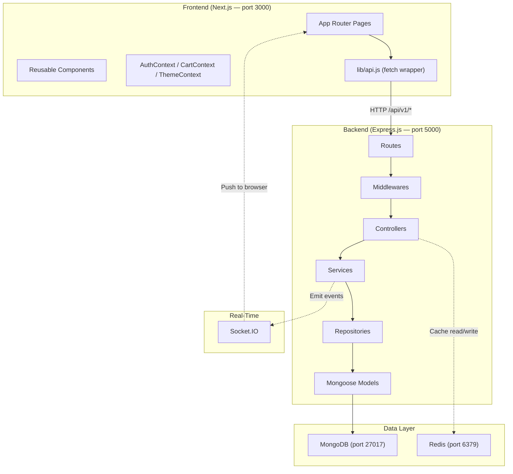

# Tekron E-Commerce — Complete Codebase Walkthrough

> Every single file in the frontend (47 files) and backend (57 files) explained in detail — architecture, libraries, animations, security, caching, and design patterns.
> 
> **For every concept below, you will find both the exact Technical Explanation and a Simple Analogy (Explain Like I'm 5) to help you instantly understand it.**

---

# Part 1: Architecture Overview

### Data Flow Summary
**Technical:** `[Browser] → fetch(/api/v1/...) → [Routes] → [Middleware] → [Controller] → [Service] → [Repository] → [MongoDB]`
**Analogy (The Restaurant):** The Frontend is the Dining Area where customers sit. The Backend is the Waiter taking orders to the Kitchen. MongoDB is the Kitchen's filing cabinet holding recipes. Redis is the Waiter's sticky note for fast answers. Socket.IO is a walkie-talkie connecting the Kitchen instantly to the Waiter.

---

# Part 2: Backend (Express.js)

## 2.1 Root Files

### `package.json`
* **Technical:** Project manifest. Module system is **CommonJS**. Entry point: `server.js`.
* **Analogy:** The shopping list of tools we bought to build the kitchen.

### `server.js` — Entry Point
* **Technical:** Bootstraps the entire application. Loads `dotenv`, requires the Express `app` from `src/app.js`, connects to MongoDB and Redis. Creates a raw `http.createServer(app)` to initialize Socket.IO on the same port (5000). Includes `unhandledRejection` handler.
* **Analogy:** The Main Power Switch. It turns on the lights, unlocks the kitchen, and turns on the walkie-talkies.

---

## 2.2 `src/app.js` — Express App Setup
* **Technical:** Configures the Express app with all middleware and routes. Applies the middleware stack in this exact order: Helmet -> CORS -> Rate Limiter -> Body Parsers -> Cookie Parser -> Compression -> Static Files -> Passport.
* **Analogy:** The Rulebook. It hires all the security guards and draws the map showing where every request should go.

---

## 2.3 `src/config/` — Configuration

* **`db.js`**:
  * **Technical:** Connects to MongoDB using Mongoose. Logs host on success, exits process on failure.
* **`env.js`**:
  * **Technical:** Environment variable validation. `requireEnv(name)` throws in production if using a fallback.
* **`passport.js`**:
  * **Technical:** Configures the Passport Local Strategy. Compares password hash via bcrypt. **Stateless** — no sessions, JWT only.
  * **Analogy:** The VIP checker setup.
* **`redis.js`**:
  * **Technical:** Redis client singleton with graceful degradation. Exponential reconnect strategy. The entire app works fine without Redis — caching just gets skipped.

---

## 2.4 `src/middlewares/` — All 8 Middlewares

* **`async.middleware.js`**:
  * **Technical:** `Promise.resolve(fn(req, res, next)).catch(next);` Wraps controllers so errors forward automatically without `try/catch`.
* **`auth.middleware.js`**:
  * **Technical:** Extracts `Bearer` token → verifies JWT → loads user → attaches `req.user`. Also handles `authorizeRoles('admin')`.
  * **Analogy:** The VIP Checker looking for your secure wristband before letting you into the boss's room.
* **`cache.middleware.js`**:
  * **Technical:** Stateless Redis Cache. On **HIT**, returns cached JSON. On **MISS**, intercepts `res.json()` to cache successful responses.
  * **Analogy:** The Sticky Note Reader that remembers answers so we don't bother the database.
* **`conditional.middleware.js`**:
  * **Technical:** Applies middleware only if condition evaluates to true.
* **`error.middleware.js`**:
  * **Technical:** Global error handler. Catches `CastError`, Duplicate key, and `TokenExpiredError` and normalizes them into 400/404/500 JSON responses.
  * **Analogy:** The Complaint Desk. Translates ugly code errors into nice messages.
* **`rateLimit.middleware.js`**:
  * **Technical:** Two limiters: `globalLimiter` (100 req/15m) and `authLimiter` (10 req/15m).
  * **Analogy:** The Bouncer stopping spammers.
* **`upload.middleware.js`**:
  * **Technical:** Multer file upload handling for JPEG/PNG (Max 5MB).
* **`validate.middleware.js`**:
  * **Technical:** Validates `req.body` against Joi schemas with `stripUnknown: true` (removes unexpected fields).
  * **Analogy:** The strict Spellchecker that deletes malicious input before it reaches the database.

---

## 2.5 `src/models/` — Mongoose Schemas (8 Models)

* **`user.model.js`**:
  * **Technical**: Enforces required fields, uniqueness on `email`, and uses a `pre('save')` hook to automatically hash the password with `bcryptjs` (10 salt rounds).
* **`product.model.js`**:
  * **Technical**: Stores product data. Uses `isActive` for "soft deletion" (hiding products without actually deleting the row).
* **`order.model.js`**:
  * **Technical**: Denormalizes the order items. It embeds a hardcopy snapshot of the product name, image, and price directly inside the order document at checkout.
  * **Analogy**: Taking a photograph of the price tag. If the admin changes the price tomorrow, the old receipt stays historically accurate.
* **`cart.model.js`**: Unique constraint per user to store cart state.
* **`review.model.js`**: Compound unique index `{ user, product }` ensuring one review per user per product.
* **`notification.model.js`**: Supports user-specific and role-based notifications.
* **`refreshToken.model.js`**: Stores a SHA-256 hash of the long-lived refresh token to prevent token reuse attacks.
* **`storeSettings.model.js`**: Singleton document for global store configs (tax rate, currency).

---

## 2.6 `src/controllers/` — Controller Layer (9 Controllers)
*(The Managers taking requests from the routes)*

* **`auth.controller.js`**:
  * **Technical**: Uses Passport `authenticate('local', { session: false })`. Generates access + refresh tokens. On refresh, it **revokes the old token** and issues a new one (Refresh Token Rotation).
* **`admin.controller.js`**: Dashboard stats, analytics, profile management, store settings.
* **`product.controller.js`**: CRUD for products. Uses `serializeProduct()` to hide stock from non-admin users.
* **`cart.controller.js`**, **`order.controller.js`**, **`review.controller.js`**, **`contact.controller.js`**, **`notification.controller.js`**, **`upload.controller.js`**.

---

## 2.7 `src/services/` — Business Logic Layer
*(The Workers doing the hard math)*

* **`order.service.js` (Most Complex File)**:
  * **Technical**: Calculates subtotal/tax/shipping. Executes an **atomic update** to decrement stock (`$inc: { stock: -quantity }`) paired with a guard (`stock: { $gte: quantity }`) to prevent race conditions. Finally, emits a Socket.IO event.
  * **Analogy**: The worker who carefully takes your money, updates the inventory list so nobody else can buy it, and buzzes the walkie-talkie to alert the kitchen.
* **`product.service.js`**: Handles regex-based search queries and pagination.
* **`review.service.js`**: Triggers a MongoDB aggregation to recalculate the `ratingAverage` every time a review is added.

---

## 2.8 `src/repositories/` — Data Access Layer
*(The Librarians)*

* **`order.repository.js` & `product.repository.js`**:
  * **Technical**: Abstracts raw Mongoose queries (`findById`, `updateOne`) away from the business logic.
  * **Analogy**: The librarians. They are the *only* ones allowed to physically open the MongoDB filing cabinets.

---

## 2.9 `src/routes/` & 2.10 `src/validators/`
*(The Map & The Rules)*

* **`routes/*.js`**: Defines the endpoints (`POST /auth/login`, `GET /products`). Attaches specific middlewares (like `protect`, `authLimiter`). (9 files).
* **`validators/*.js`**: Defines the Joi object schemas (e.g., `Joi.string().email()`, `Joi.number().min(1).max(5)`). (6 files).

---

## 2.11 `src/sockets/socket.js` — WebSocket Layer
* **Technical**: Upgrades HTTP to WebSocket. Extracts the JWT from `socket.handshake.auth.token` to verify the user, and assigns them to an isolated Socket "room" (`user:{id}`). Admins join `admin_room`. Emits `new-order` and `order-status-updated`.
* **Analogy**: The Walkie-Talkies. It ensures a user only hears updates for their own orders, while admins hear all new orders.

---

## 2.12 `src/utils/` & 2.13 `scripts/`
* **Utils**: `ApiError.js`, `generateTokens.js` (makes the wristbands), `uploads.js`.
* **Scripts**: `seed.js`, `seedAdmin.js`, `seedProducts.js` (Fills the empty DB with sample Apple products).

---
---

# Part 3: Frontend (Next.js)

## 3.1 Root Configuration
* **`package.json`**: React 18, TailwindCSS, Socket.IO-Client.
* **`next.config.js`**:
  * **Technical**: Configures API `rewrites()` to proxy `/api/v1` to `localhost:5000` during development, bypassing browser CORS restrictions.
* **`tailwind.config.js`**:
  * **Technical**: Extends the default theme. Maps CSS variables (`--primary`) to Tailwind utility classes, and defines custom `@keyframes` for hardware-accelerated animations (`fadeLift`, `cartPop`, `shimmer`, `float`).

## 3.2 Global Styles (`app/globals.css`)
* **Technical**: Defines root HSL color variables. Applies a base64-encoded SVG noise texture to the `body` background merged with a radial gradient. Defines `.surface-card` utility classes using `backdrop-filter: blur(...)`.
* **Analogy**: The paint and decor. We made it look premium by adding physical "TV static" texture and frosted glass to everything.

## 3.3 App Layout & Providers
* **`layout.jsx`**: The outer shell. Sets `lang="en"`, loads **Inter** font from Google Fonts.
* **`providers.jsx`**: Wraps the entire app in `ThemeProvider → AuthProvider → CartProvider → Toaster`.

## 3.4 Context (State Management)
* **`AuthContext.jsx`**:
  * **Technical**: React Context provider. Holds the `user` object in state. On mount, silently calls `/auth/refresh-token` to auto-login returning users.
* **`CartContext.jsx`**:
  * **Technical**: Manages cart state. If unauthenticated, it persists to `window.localStorage`. Upon login, it executes a smart merge, syncing the local cart with the backend database.
* **`ThemeContext.jsx`**: Forces Dark Mode always.

## 3.5 `lib/` — Utilities
* **`api.js`**:
  * **Technical**: A custom wrapper around the native `fetch` API. It automatically intercepts 401 Unauthorized errors, requests a new access token using the httpOnly refresh cookie, and seamlessly retries the original failed request.
* **`images.js`**: Fixes image URLs.
* **`products.js`**: Helpers for checking out-of-stock labels.

---

## 3.6 Customer-Facing Pages (`app/(site)/`)
* **`layout.jsx`**: Shows `BackgroundShapes` + `Navbar` + `CartDrawer` + `{children}` + `Footer` + `BackToTop`.
* **`page.js`**: Home page with `HeroSlideshow`.
* **`products/page.jsx`**: Product catalog with debounce searching via `CatalogToolbar`.
* **`products/[slug]/page.js`**: Specific product detail page.
* **`cart/page.jsx`**: Cart Page.
* **`checkout/page.jsx`**: Checkout flow supporting both guest and authenticated users. Triggers the `Confetti` animation on success.
* **`orders/page.jsx`**: Mounts the `socket.on('order-status-updated')` listener to re-fetch orders in real time.
* **`auth/login/page.jsx` & `auth/register/page.jsx`**: Forms with `surface-panel` + `aurora-sheen`.

---

## 3.7 All Components — Deep Dive
*(The reusable LEGO pieces)*

* **`HeroSlideshow.js`**: 3 slides, auto-advances every 5s. Overlay text uses a `bg-clip-text` gradient rotated -3deg, with a 1500ms scale animation.
* **`ProductCard.js`**:
  * **Technical**: Calculates pointer coordinates relative to the bounding box to apply CSS `transform: perspective(900px) rotateX(...) rotateY(...)` for a 3D tilt effect (3.5° max).
* **`Navbar.jsx`**: Uses scroll event listeners to dynamically increase the `backdrop-blur` intensity as the user scrolls down.
* **`SearchOverlay.jsx`**: Full-screen overlay with debounced search (220ms).
* **`CartDrawer.jsx`**: Slide-in drawer with `animate-cart-pop`.
* **`BackgroundShapes.jsx`**:
  * **Technical**: 4 large absolute-positioned circles (cyan, amber, teal) with `blur-[120px]` and infinite CSS `@keyframes float` to create the moving aurora effect.
* **`ScrollReveal.jsx`**:
  * **Technical**: Utilizes the native `IntersectionObserver` API. When an element intersects the viewport threshold (0.12), it toggles Tailwind opacity and translation classes (700ms cubic-bezier transition).
* **`Confetti.jsx`**: 50 particles with random colors using inline `@keyframes fall`.
* **Others**: `SectionDivider.jsx` (animated gradient line), `ProductQuickView.jsx`, `Logo.jsx`, `BackToTop.jsx`, `SafeImage.jsx`, `Footer.jsx`, `CatalogToolbar.jsx`, `ImageUploadField.jsx`, `Skeleton.jsx`, `EmptyState.jsx`, `FeatureCard.jsx`.

---

## 3.8 Admin Section
* **`admin/layout.jsx`**: Sidebar navigation. Redirects non-admin users to login.
* **`admin/page.jsx`**: Dashboard. Listens for `socket.on('new-order')` to update revenue live.
* **`admin/analytics/page.jsx`**: **Custom SVG chart** (polyline + polygon area chart with gradient stroke/fill).
* **Others**: `admin/customers`, `admin/orders`, `admin/products`, `admin/settings`.

---

# Part 4: Complete Animation & Effect Inventory

| Effect | Technical Implementation | Analogy (ELI5) | Where Used |
|--------|--------------------------|----------------|-----------|
| **3D Card Tilt** | `perspective(900px) rotateX/Y` via JS pointer tracking. | Rotates the box up to 3.5 degrees in 3D space when hovered. | ProductCard |
| **Glassmorphism** | `backdrop-blur-xl` + `bg-card/[0.72]` + subtle borders. | Makes semi-transparent boxes look like frosted glass. | Panels, navbar |
| **Aurora Sheen** | Gradient sweep overlay (primary → accent → secondary). | Sweeps colors across the screen to look like glowing lights. | Cards, hero |
| **Scroll Reveal** | `IntersectionObserver` + `opacity/translateY` transition. | Waits until an element scrolls into view, then fades it in. | All pages |
| **Hero Slideshow** | CSS transitions (2s scale, 1.5s translate). | Slowly scales up the image, then switches to the next. | Home page |
| **Floating Blobs** | `@keyframes float` (18-30s infinite) + `blur-[120px]`. | Bounces big blurred circles up and down over 30 seconds. | Background |
| **Shimmer Loading** | `@keyframes shimmer` gradient sweep. | A gradient sweeping horizontally to show something is loading. | Skeletons |

---

# Part 5: Backend Concepts Checklist

| Concept | Technical Implementation | Analogy (ELI5) | File(s) |
|---------|--------------------------|----------------|---------|
| ✅ **Helmet** | `app.use(helmet())` for security HTTP headers. | The Bodyguard adding secret locks. | `app.js` |
| ✅ **Stateless Cache** | Redis read-through cache with TTL. | The Sticky Note remembering answers. | `cache.middleware.js` |
| ✅ **Rate Limiting** | `express-rate-limit` (100/15m). | The Bouncer stopping spammers. | `rateLimit.middleware.js` |
| ✅ **JWT Auth** | Memory access tokens + httpOnly refresh rotation. | The VIP Wristband used instead of sessions. | `auth.controller.js` |
| ✅ **Input Validation** | Joi schemas with `stripUnknown`. | The Spellchecker deleting malicious input. | `validators/` |
| ✅ **WebSockets** | Socket.IO with JWT auth + rooms. | The Walkie-Talkie for instant live updates. | `socket.js` |
| ✅ **Atomic Stock** | `$inc` with `$gte` guard + rollback. | Carefully deducting stock to stop double-buys. | `order.service.js` |
| ✅ **Guest Checkout** | `optionalAuth` + `guestCustomer` embedded doc. | Buying without creating an account. | `order.routes.js` |

---

# Part 6: Expected Viva Questions & Answers

**Q1: Why did you choose Next.js instead of regular React?**
* **Technical**: "Next.js provides the App Router with Server-Side Rendering (SSR). This reduces the initial JavaScript payload to the browser, offering a faster First Contentful Paint (FCP) and significantly better SEO compared to a traditional Client-Side Rendered (CSR) SPA."
* **Analogy**: "It's like a restaurant that pre-cooks the food. When a user visits, the page loads instantly because the server already prepared the HTML. Regular React makes the user's browser do all the cooking, which is slower."

**Q2: How does your authentication system work? Are you using sessions?**
* **Technical**: "No, it is entirely stateless. We implemented JWT (JSON Web Tokens). Upon login, the server issues a short-lived access token (kept in memory) and a long-lived refresh token (stored securely in an `httpOnly` cookie to prevent XSS). We also utilized Refresh Token Rotation to prevent token reuse."
* **Analogy**: "It's like giving users a cryptographic VIP wristband. The server doesn't need to remember who is logged in via a database session; it just mathematically verifies the wristband on every request."

**Q3: How are you handling real-time updates?**
* **Technical**: "I integrated Socket.IO for WebSockets. When a mutation occurs (like an order status changing in the DB), the Express service emits an event targeting a specific `user:{id}` room. The Next.js client listens for this event and triggers a React state update instantly."
* **Analogy**: "It's a two-way walkie-talkie. Instead of the browser constantly asking the server 'is my order ready?', the server just buzzes the browser the exact second the status changes."

**Q4: How did you optimize the backend performance?**
* **Technical**: "I implemented a stateless Redis caching layer via middleware. For read-heavy endpoints like the product catalog, the API attempts to retrieve the JSON response from Redis memory. On a cache hit, it bypasses the MongoDB query completely, reducing latency from ~100ms down to ~5ms."
* **Analogy**: "Redis is the server's sticky note. Instead of walking to the kitchen filing cabinet every time, the waiter writes the answer on a sticky note and serves the next 100 customers instantly."

**Q5: What security measures did you implement?**
* **Technical**: "I employed defense-in-depth: `Helmet.js` sets secure HTTP headers. `express-rate-limit` prevents brute-forcing. `Joi` strictly sanitizes incoming JSON payloads. Finally, `bcryptjs` utilizes 10 salt rounds to hash passwords, ensuring plain-text passwords are never stored."
* **Analogy**: "Helmet is the bodyguard locking doors. The rate-limiter is the bouncer stopping spammers. Joi is the spellchecker deleting bad data."

**Q6: How did you design the database for Orders? What happens if a product's price changes?**
* **Technical**: "In MongoDB, I intentionally denormalized the order item subdocuments. Instead of merely storing an `ObjectId` reference to the Product, the system takes a snapshot of the product's name and price at checkout time. This ensures the historical integrity of the receipt."
* **Analogy**: "We take a photograph of the price tag when you check out. If the admin deletes the product or doubles the price tomorrow, your old receipt doesn't change."

**Q7: How did you implement smooth animations?**
* **Technical**: "I avoided JS-based animation loops (like GSAP) and relied on hardware-accelerated CSS properties (`transform: translate` and `scale`) via Tailwind keyframes. CSS animations are offloaded to the GPU, preventing main-thread blocking and ensuring 60fps performance."
* **Analogy**: "Heavy Javascript animations slow down computers. By using CSS, we tell the computer's Graphics Card to handle the smooth sliding and fading, which works perfectly even on slow phones."

---

# Part 7: Core Libraries Dictionary

* **Next.js**: The React framework that builds the frontend UI and handles routing.
* **Express.js**: The Node.js web framework that acts as our backend API server.
* **MongoDB & Mongoose**: Our NoSQL database (MongoDB) and the tool we use to enforce strict rules on the data (Mongoose).
* **Redis**: The super-fast, in-memory cache that stores temporary data to speed up API responses.
* **Socket.IO**: The WebSockets library that enables instant, real-time communication between frontend and backend.
* **JWT**: A secure, mathematical way to verify logged-in users without storing sessions in the database.
* **Tailwind CSS**: A tool that lets us style the website quickly using small utility classes like `text-center` and `blur-xl`.
* **Joi**: A security tool that checks and sanitizes all incoming data before it touches our database.
* **Helmet**: A security middleware that protects the app from common web exploits by setting HTTP headers.
