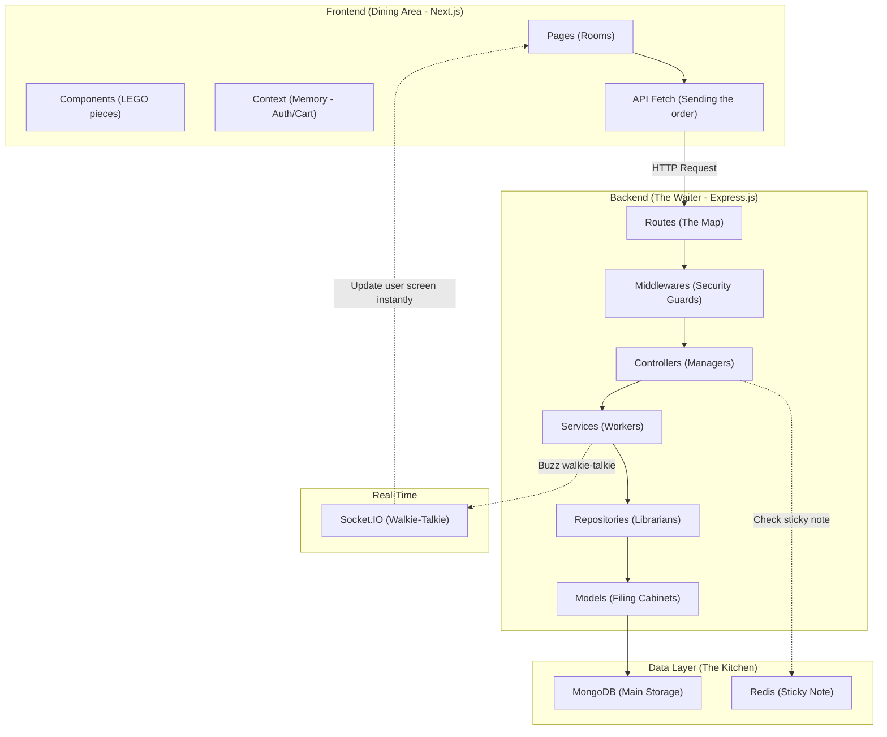

# Tekron E-Commerce — Complete Codebase Walkthrough (Simple Edition)

> Every single file in the frontend (47 files) and backend (57 files) mapped out. This uses the **Fancy Restaurant** analogy to explain what every single file actually does in simple English, so you can easily understand and explain the architecture during your viva.

---

# Part 1: Architecture Overview

Imagine your e-commerce app is a **Fancy Restaurant**.

* **Frontend (Next.js)** = The **Dining Area**. It's what the customers see (menus, tables, lights).
* **Backend (Express.js)** = The **Waiter**. The waiter takes the customer's order from the dining area to the kitchen.
* **Database (MongoDB)** = The **Kitchen's Filing Cabinet**. Safely stores food recipes (Products), employee records (Users), and old receipts (Orders).
* **Cache (Redis)** = The Waiter's **Sticky Note**. Instead of walking to the kitchen to ask "what is the soup of the day?" every 5 seconds, the waiter writes it on a sticky note for instant answers.
* **Real-time (Socket.IO)** = A **Walkie-Talkie**. When a customer's order is ready, the kitchen buzzes the walkie-talkie to tell the waiter instantly without waiting to be asked.
* **Authentication (JWT)** = A **VIP Wristband**. Instead of checking ID on every page, we give logged-in users a mathematical wristband.

---

# Part 2: Backend (Express.js)

## 2.1 Root Files (The Managers)

* **`package.json`**: The shopping list of tools we bought (Express, Mongoose, Redis, etc.).
* **`server.js`**: The Main Power Switch. It turns on the server, connects to MongoDB (the Kitchen), connects to Redis (the Sticky Note), and turns on the Socket.IO walkie-talkies.

## 2.2 `src/app.js` — Express App Setup
This is the **Rulebook**. It hires all the security guards (Middlewares) and sets up the map of where every request should go (Routes like `/api/v1/auth`).

## 2.3 `src/config/` — Configuration Files
* **`db.js`**: The code that actually connects to the MongoDB Kitchen.
* **`env.js`**: Checks that all our secret passwords (like database URLs) are loaded properly.
* **`passport.js`**: The VIP checker setup. It verifies email and passwords.
* **`redis.js`**: The Sticky Note setup. Connects to Redis, but won't crash the app if Redis is turned off.

## 2.4 `src/middlewares/` — The Security Guards (8 Files)
Middlewares are checkpoints every request must pass through.
* **`async.middleware.js`**: A helper that stops the app from crashing if a worker makes a mistake (catches errors).
* **`auth.middleware.js`**: The VIP Checker. Looks for the JWT wristband. If you don't have it, you get a 401 error.
* **`cache.middleware.js`**: The Sticky Note Reader. Checks Redis to see if we already know the answer to a request before bothering the database.
* **`conditional.middleware.js`**: A helper to sometimes skip certain rules depending on the route.
* **`error.middleware.js`**: The Complaint Desk. Translates ugly code errors into nice, readable messages for the user.
* **`rateLimit.middleware.js`**: The Bouncer. If one IP address tries to guess a password 100 times in a minute, the bouncer temporarily bans them.
* **`upload.middleware.js`**: Handles saving picture uploads to the hard drive.
* **`validate.middleware.js`**: The strict Spellchecker (uses Joi). Deletes bad or malicious data before it reaches the database.

## 2.5 `src/models/` — Mongoose Schemas (8 Models)
This defines exactly *how* we store things in the MongoDB filing cabinet.
* **`user.model.js`**: Stores email, hashed password (using `bcryptjs`), and role (`admin` or `customer`).
* **`product.model.js`**: Stores product name, price, stock count, and images.
* **`order.model.js`**: Stores who bought what. **Smart trick:** Instead of just pointing to the product ID, we take a "snapshot" of the price at checkout so if the price changes tomorrow, old receipts stay the same!
* **`cart.model.js`**: Saves the user's shopping basket.
* **`review.model.js`**: Saves 1-5 star ratings and comments.
* **`notification.model.js`**: Saves messages for users or admins.
* **`refreshToken.model.js`**: Remembers the long-lasting VIP wristbands to keep users logged in securely.
* **`storeSettings.model.js`**: Saves store configuration like tax rates and shipping fees.

## 2.6 `src/controllers/` — Controller Layer (9 Controllers)
The Managers. They take requests from the Routes and assign them to the Workers (Services).
* **`auth.controller.js`**: Handles login/logout. Generates the JWT Access Token (wristband) and Refresh Token.
* **`admin.controller.js`**: Gathers stats (revenue, orders) for the admin dashboard.
* **`product.controller.js`**: Handles adding, editing, or deleting products.
* **`cart.controller.js`**: Handles adding items to the cart.
* **`order.controller.js`**: Thin manager that passes order placement to the `orderService`.
* **`review.controller.js`**: Handles product reviews.
* **`contact.controller.js`**: Handles the "Contact Us" form.
* **`notification.controller.js`**: Lists notifications for the user.
* **`upload.controller.js`**: Returns the file path after an image is uploaded.

## 2.7 `src/services/` — Business Logic Layer
The actual Workers who do the hard math and complex logic.
* **`order.service.js`**: The hardest worker (256 lines). It calculates tax/shipping, atomically deducts the item from the kitchen's inventory (so two people can't buy the last item at the exact same time), and buzzes the walkie-talkie (`new-order`) to alert the admin.
* **`product.service.js`**: Handles complex searching, filtering, and sorting of products.
* **`review.service.js`**: Automatically recalculates the average 5-star rating of a product every time a new review is added.

## 2.8 `src/repositories/` — Data Access Layer
The Librarians. They are the only ones allowed to actually open the MongoDB filing cabinets.
* **`order.repository.js`**: Finds and saves orders in the database.
* **`product.repository.js`**: Finds and saves products in the database.

## 2.9 `src/routes/` — Route Definitions (9 Files)
The Map of doors in the restaurant.
* **`auth.routes.js`**: Maps URLs like `POST /login` and `POST /register` to the Auth Controller.
* **`product.routes.js`**: Maps URLs like `GET /products` to the Product Controller.
* **`order.routes.js`**: Maps URLs like `POST /orders`.
* (Also contains routes for admin, cart, contact, notifications, reviews, and uploads).

## 2.10 `src/validators/` — Joi Schemas (6 Files)
The exact spellcheck rules for the `validate.middleware.js`.
* **`auth.validator.js`**: Rules saying "email must be valid format, password must be at least 6 characters".
* **`cart.validator.js`**: Rules saying "quantity must be between 1 and 99".
* **`order.validator.js`**: Rules ensuring a shipping address is provided.
* **`product.validator.js`**: Rules for creating a product.
* **`review.validator.js`**: Rules saying "rating must be a number between 1 and 5".
* **`contact.validator.js`**: Rules for the contact form.

## 2.11 `src/sockets/socket.js` — WebSocket Layer
The Walkie-Talkie setup. It extracts the JWT wristband to verify the user, then creates specific "rooms". This ensures a user only hears updates for their own orders, while admins join a special `admin_room` to hear all new orders.

## 2.12 `src/utils/` — Utilities
* **`ApiError.js`**: A custom tool to easily create error messages.
* **`generateTokens.js`**: The machine that mathematically creates the JWT wristbands.
* **`uploads.js`**: Ensures the `/uploads` folder actually exists on the hard drive.

## 2.13 `scripts/` — Database Seeders
* **`seed.js`**, **`seedAdmin.js`**, **`seedProducts.js`**: Scripts you can run to instantly fill the empty database with 13 sample Apple products and a default admin account.

---

# Part 3: Frontend (Next.js)

## 3.1 Root Configuration
* **`package.json`**: The tools we used (React, Tailwind, Next.js).
* **`next.config.js`**: Rules for Next.js. We use it to proxy `/api/v1` requests so we don't get CORS (Cross-Origin) errors during development.
* **`tailwind.config.js`**: Where we defined our custom restaurant colors (Primary Gold, Accent Blue) and custom CSS animations (like `fadeLift` and `shimmer`).

## 3.2 Global Styles — The Design System
* **`app/globals.css`**: How we made the app look premium. We added a physical "Noise Texture" (like old TV static) mixed with a dark radial gradient for the background. We also created "Glassmorphism" classes here using `backdrop-filter: blur(...)` to make boxes look like frosted glass.

## 3.3 App Layout & Providers
* **`app/layout.jsx`**: The outer shell of the website. It loads the Google Fonts.
* **`app/providers.jsx`**: Wraps the entire app in the Auth, Cart, and Theme memory (Contexts) so every page has access to them.

## 3.4 Context (State Management / The Memory)
* **`context/AuthContext.jsx`**: Remembers if you are wearing the VIP wristband (JWT token) so the frontend knows to show you the "My Orders" button instead of "Login".
* **`context/CartContext.jsx`**: The Shopping Basket. If you aren't logged in, it saves your items in your browser's `localStorage`. When you log in, it automatically moves them to the server.
* **`context/ThemeContext.jsx`**: Forces Dark Mode everywhere.

## 3.5 `lib/` — Utilities
* **`lib/api.js`**: The custom `fetch` tool. It automatically attaches your VIP wristband (token) to every single request you send to the backend.
* **`lib/images.js`**: Fixes image URLs so they load correctly.
* **`lib/products.js`**: Helpers for checking if a product is out of stock.

## 3.6 Customer-Facing Pages (`app/(site)/`)
Next.js uses folders to automatically create physical web pages.
* **`layout.jsx`**: The wrapper that shows the Navbar, Cart Drawer, and Footer on every page.
* **`page.js`**: The Home Page. Contains the slideshow of iPhones/MacBooks.
* **`about/page.js`**: The About Page.
* **`products/page.jsx`**: The Catalog. Shows all products and has a search bar.
* **`products/[slug]/page.js`**: The specific Product Detail page.
* **`cart/page.jsx`**: The Cart Page.
* **`checkout/page.jsx`**: The Checkout page. Shoots Confetti 🎉 across the screen when you finish!
* **`orders/page.jsx`**: My Orders page.
* **`auth/login/page.jsx`**: The Login page.
* **`auth/register/page.jsx`**: The Register page.

## 3.7 All Components — Deep Dive (`components/`)
Instead of building a new button every time, we build it once and reuse it (like LEGO pieces).
* **`HeroSlideshow.js`**: The auto-rotating images on the home page.
* **`ProductCard.js`**: The beautiful glass box holding a product. It uses 3D CSS `perspective` to physically tilt when your mouse moves over it.
* **`Navbar.jsx`**: The top menu. It uses `backdrop-blur` to turn into frosted glass when you scroll down.
* **`SearchOverlay.jsx`**: The full-screen search screen that pops up.
* **`CartDrawer.jsx`**: The cart menu that slides in from the right.
* **`BackgroundShapes.jsx`**: 4 large colorful circles (cyan, amber, teal). They have a massive CSS `blur` filter applied and use an `@keyframes float` animation to drift around the screen over 30 seconds.
* **`ScrollReveal.jsx`**: Uses the browser's `IntersectionObserver` to magically fade text in as you scroll down the page.
* **`Confetti.jsx`**: The code that shoots the confetti.
* **`SectionDivider.jsx`**: The glowing line between sections.
* **Others**: `ProductQuickView.jsx`, `Logo.jsx`, `BackToTop.jsx`, `SafeImage.jsx`, `Footer.jsx`, `CatalogToolbar.jsx`, `ImageUploadField.jsx`, `Skeleton.jsx`, `EmptyState.jsx`, `FeatureCard.jsx`.

## 3.8 Admin Section
The secret boss rooms.
* **`app/admin/layout.jsx`**: The sidebar navigation for admins.
* **`app/admin/page.jsx`**: The Dashboard. It listens for Socket.IO events to update the revenue chart live.
* **`app/admin/analytics/page.jsx`**: The page with custom SVG graphs showing sales over time.
* **`app/admin/customers/page.jsx`**: List of all customers.
* **`app/admin/orders/page.jsx`**: Allows admin to change order statuses.
* **`app/admin/products/page.jsx`**: Allows admin to add/edit products.
* **`app/admin/settings/page.jsx`**: Store settings.

---

# Part 4: Complete Animation & Effect Inventory

| Effect | How it works (ELI5) | Where Used |
|--------|---------------------|-----------|
| **3D Card Tilt** | Tracks your mouse and rotates the box up to 3.5 degrees in 3D space. | ProductCard |
| **Glassmorphism** | Uses `backdrop-blur-xl` to make semi-transparent boxes look like frosted glass. | Panels, cards, navbar |
| **Aurora Sheen** | A gradient of colors sweeping across the screen to look like glowing lights. | Cards, hero |
| **Scroll Reveal** | Waits until an element scrolls into view, then fades it in. | All pages |
| **Hero Slideshow** | Slowly scales up the image over 2 seconds, then switches to the next. | Home page hero |
| **Floating Blobs** | CSS animations that slowly bounce big blurred circles up and down over 30 seconds. | BackgroundShapes |
| **Shimmer Loading** | A gradient sweeping horizontally to show something is loading. | Skeletons |

---

# Part 5: Backend Concepts Checklist

| Concept | How it works (ELI5) | File(s) |
|---------|---------------------|---------|
| ✅ **Helmet** | The Bodyguard adding secret security headers. | `app.js` |
| ✅ **Stateless Cache** | The Redis Sticky Note remembering answers so we don't bother the database. | `cache.middleware.js` |
| ✅ **Rate Limiting** | The Bouncer stopping spammers. | `rateLimit.middleware.js` |
| ✅ **JWT Auth** | The VIP Wristband used instead of traditional login sessions. | `auth.controller.js` |
| ✅ **Input Validation** | The Joi Spellchecker deleting malicious input. | `validators/` |
| ✅ **WebSockets** | The Socket.IO Walkie-Talkie for instant live updates. | `socket.js` |
| ✅ **Atomic Stock Management** | Carefully deducting stock so two people can't buy the exact same final item at once. | `order.service.js` |

---

# Part 6: Expected Viva Questions & Answers

**Q1: Why did you choose Next.js instead of regular React?**
*A1:* "Next.js provides an App Router which allows for server-side rendering, better SEO, and optimized asset loading. It's like a restaurant that pre-cooks the food—when a user visits, the page loads instantly because Next.js already prepared the HTML on the server. Regular React makes the user's browser do all the cooking, which is slower."

**Q2: How does your authentication system work? Are you using sessions?**
*A2:* "No, it's completely stateless. I used JWT (JSON Web Tokens), which is like a cryptographic VIP wristband. When a user logs in, the server generates a short-lived access token (kept in memory) and a long-lived refresh token stored securely in an HTTP-only cookie. We also implemented Refresh Token Rotation to automatically revoke old refresh tokens and issue new ones, preventing token reuse attacks."

**Q3: How are you handling real-time updates for orders?**
*A3:* "I integrated Socket.IO, which is like a two-way walkie-talkie. When an order status is changed in the admin panel, the backend Express service emits an `order-status-updated` event targeting a specific user's 'room'. The Next.js frontend listens for this and updates the UI instantly without needing a page refresh."

**Q4: How did you optimize the backend performance?**
*A4:* "I implemented a stateless Redis caching layer. Redis is like the server's sticky note. For example, the public product catalog is cached in Redis with a Time-To-Live (TTL). When a request comes in, a middleware checks Redis first, and if there's a cache hit, it bypasses the database query entirely, reducing latency."

**Q5: What security measures did you implement?**
*A5:* "I used several layers: Helmet.js (the bodyguard) for secure HTTP headers, express-rate-limit (the bouncer) to prevent brute-force attacks on authentication routes, Joi schemas to strictly validate and sanitize all incoming JSON data, and bcrypt with 10 salt rounds to hash passwords before storing them."

**Q6: How did you design the database for Orders? What happens if a product's price changes?**
*A6:* "In Mongoose, instead of just linking an order to a Product ID, I denormalized the data. The order item subdocument takes a 'snapshot' of the product's name, price, and image at the exact time of checkout. This ensures the historical receipt is immutable, even if the admin deletes the product or changes its price tomorrow."

**Q7: How did you implement animations without making the app slow?**
*A7:* "Heavy Javascript animations slow down computers. Instead, I avoided JavaScript animation libraries and relied on hardware-accelerated CSS animations via Tailwind keyframes (like `translate` and `scale`). CSS utilizes the computer's GPU, which makes the sliding and fading buttery smooth. For scroll animations, I built a lightweight `ScrollReveal` component using the native IntersectionObserver API."

---

# Part 7: Core Libraries Dictionary

* **Next.js**: The React framework that builds the frontend UI and handles routing.
* **Express.js**: The Node.js web framework that acts as our backend API server.
* **MongoDB & Mongoose**: Our NoSQL database (MongoDB) and the tool we use to enforce strict rules on the data (Mongoose).
* **Redis**: The super-fast, in-memory cache that stores temporary data to speed up API responses.
* **Socket.IO**: The WebSockets library that enables instant, real-time communication between frontend and backend.
* **JWT**: A secure, mathematical way to verify logged-in users without storing sessions in the database.
* **Tailwind CSS**: A tool that lets us style the website quickly using small utility classes like `text-center` and `blur-xl`.
* **Joi**: A security tool that checks and sanitizes all incoming data before it touches our database.
* **Helmet**: A security middleware that protects the app from common web exploits by setting HTTP headers.
